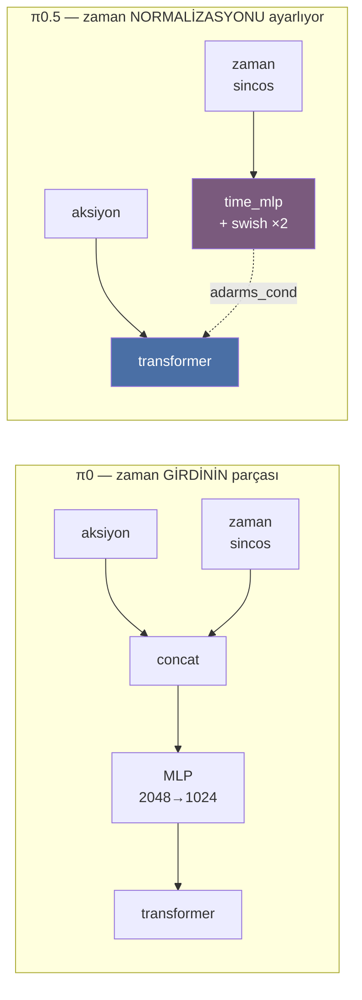

# π0.5 — kaynak kod incelemesi

> **Kaynak (2026-08-04 çekildi):**
> `github.com/Physical-Intelligence/openpi` →
> `src/openpi/models/pi0.py`, `src/openpi/models/pi0_config.py`
>
> Kardeş dokümanlar:
> `../pi0_fast/pi0_fast_notes.md` (π0-FAST),
> `../pi0_pytorch/pi0_pytorch_notes.md` (π0 PyTorch)
>
> ✅ **Doğrulama durumu:** Bu doküman önce özetleyici bir web çekimiyle yazıldı,
> sonra ham kaynak `curl` ile indirilip (279 + 117 satır) **karşılaştırıldı**.
> Doğrulananlar: `pi05` bayrağının altı geçişi ve satır numaraları, alıntılanan
> `embed_suffix` bloğunun birebirliği, `action_horizon=50`, `max_token_len`
> 200/48 dallanması, `discrete_state_input = pi05`, "I'm sorry" yorumunun
> satır 227'de olduğu, ve `pi0.py`'de **hiç `stop_gradient` bulunmadığı** (§6).
> Sapma çıkmadı.

---

## 0. Önce beklentiyi düzeltelim: π0.5 diye bir dosya YOK

`src/openpi/models/` dizininin tamamı:

```
__init__.py   gemma.py   gemma_fast.py   lora.py      lora_test.py
model.py      pi0.py     pi0_config.py   pi0_fast.py  pi0_test.py
siglip.py     tokenizer.py   tokenizer_test.py   vit.py   utils/
```

`pi05.py` yok. `pi0_5.py` yok. Çünkü **π0.5 ayrı bir model değil, bir `bool`.**

```python
# pi0_config.py
pi05: bool = False
```

Aynı `Pi0` sınıfı, aynı `compute_loss`, aynı `sample_actions`. Fark: dosya içinde
üç-dört yerde `if self.pi05:` dalı.

Bu kötü bir haber değil — tam tersi, **en net dokümantasyon**: iki model
arasındaki farkın tamamı bu dallardan ibaret, başka hiçbir yerde saklı değil.

---

## 1. Farkın resmi tanımı: config'in kendi yorumu

`pi0_config.py`'de, `pi05` alanının hemen üstünde yazarların kendi cümlesi:

```python
# Pi05 has two differences from Pi0:
# - the state input is part of the discrete language tokens rather than a
#   continuous input that is part of the suffix
# - the action expert uses adaRMSNorm to inject the flow matching timestep
pi05: bool = False
```

Türkçesi:

| # | π0 | π0.5 |
|---|---|---|
| 1 | `state` → **sürekli** vektör, suffix'te ayrı token | `state` → **ayrık** dil token'ı, prefix'te metin |
| 2 | zaman → aksiyona **concat** edilip MLP'den geçer | zaman → **adaRMSNorm** ile enjekte edilir |

PyTorch dosyasını okurken bunu koddan çıkarmıştık (`pi0_pytorch_notes.md` §8.2);
burada yazarların kendi ağzından doğrulanmış oluyor. Başka fark yok — **model
mimarisi düzeyinde π0.5, π0'ın iki küçük varyasyonu.**

---

## 2. En konuşkan kanıt: `max_token_len`

```python
def __post_init__(self):
    if self.max_token_len is None:
        object.__setattr__(self, "max_token_len", 200 if self.pi05 else 48)
    if self.discrete_state_input is None:
        object.__setattr__(self, "discrete_state_input", self.pi05)
```

| | π0 | π0.5 |
|---|---|---|
| `max_token_len` | **48** | **200** |
| `discrete_state_input` | `False` | `True` |

**48 → 200, dört küçük katı.** Neden? Çünkü π0'da prompt sadece görev talimatı
("pick up the cup") — 48 token fazlasıyla yeter. π0.5'te oraya bir de
**ayrıklaştırılmış state** giriyor:

```
π0    prefix:  "pick up the cup"                              ≤ 48 token
π0.5  prefix:  "Task: pick up the cup, State: 128 71 200 ...;" ≤ 200 token
                                      └── 32 sayı, metin olarak ──┘
```

Tanıdık geldi mi? **Bu tam olarak π0-FAST'in `FASTTokenizer.tokenize()`'daki
prefix formatı.** (`pi0_fast_notes.md` §9.5'te satır satır incelemiştik:
`np.digitize` ile 256 kutu, `" ".join(map(str, ...))`.)

Yani π0.5, state kodlamasını **π0-FAST'ten ödünç alıyor**. Aksiyon tarafında
flow matching, state tarafında FAST'in metin yaklaşımı.

`discrete_state_input` alanının yorumu da bunu doğruluyor:

```python
# This config option is not used directly by the model, but it is read by the ModelTransformFactory.
discrete_state_input: bool = None
```

Model bu bayrağı okumuyor — **veri hattı** okuyor. Yani state'in
ayrıklaştırılması `pi0.py`'de değil, transform katmanında oluyor. Tıpkı FAST
tokenizer'ın model dosyasında olmaması gibi.

---

## 3. `Pi0Config` alan alan

```python
@dataclasses.dataclass(frozen=True)
class Pi0Config(_model.BaseModelConfig):
    dtype: str = "bfloat16"
    paligemma_variant: _gemma.Variant = "gemma_2b"
    action_expert_variant: _gemma.Variant = "gemma_300m"

    action_dim: int = 32
    action_horizon: int = 50
    max_token_len: int = None
    pi05: bool = False
    discrete_state_input: bool = None
    pytorch_compile_mode: str | None = "max-autotune"
```

| Alan | Değer | Not |
|---|---|---|
| `paligemma_variant` | `gemma_2b` | omurga: 2B, width 2048, depth 18 |
| `action_expert_variant` | `gemma_300m` | uzman: width **1024**, depth **18** |
| `action_dim` | 32 | robotlar buraya sıfır-dolgulanıyor |
| `action_horizon` | **50** | ← dikkat, 32 değil |
| `pytorch_compile_mode` | `max-autotune` | en agresif derleme |

⚠️ **Önceki notumda düzeltme:** `pi0_pytorch_notes.md`'de aksiyon parçasını
`[32 adım, 32 boyut]` diye örneklemiştim. `action_dim=32` doğru ama
**`action_horizon` varsayılanı 50**. Doğrusu `[50, 32]`, kayıp şekli `[B, 50, 32]`.
(π0-FAST farklı: orada `action_horizon=32`, `max_token_len=250` — o doküman doğru.)

`gemma_300m`'in `depth=18` olması, `pi0_pytorch_notes.md` §15.4'te bulduğumuz
"derinlik eşit olmak zorunda" kısıtıyla uyumlu — uzman sadece **width**
bakımından küçük (2048 → 1024), katman sayısı aynı.

---

## 4. `pi0.py` — `pi05` dallarının tamamı

> Bu bölümdeki satır numaraları ham kaynaktan (`curl` ile indirilmiş 279 satırlık
> dosya) doğrulandı. Alıntılanan kod blokları birebir.

Bayrağın dosyadaki **altı** geçişinin tamamı:

| Satır | İfade | Nerede |
|---|---|---|
| 69 | `self.pi05 = config.pi05` | `__init__` — atama |
| 77 | `adarms=config.pi05` | `__init__` — Gemma modülü |
| 80 | `use_adarms=[False, True] if config.pi05 else [False, False]` | `__init__` — lazy_init |
| 93 | `if config.pi05:` | `__init__` — katman seçimi |
| 151 | `if not self.pi05:` | `embed_suffix` — state token'ı |
| 162 | `if self.pi05:` | `embed_suffix` — zaman yolu |

**Hepsi bu.** `compute_loss` ve `sample_actions` bayrağı hiç görmüyor —
π0/π0.5 farkı oralara sadece `embed_suffix`'in dönüş değeri
(`adarms_cond`) üzerinden sızıyor.

### 4.1 `__init__` — hangi katmanlar yaratılıyor

```python
self.pi05 = config.pi05
...
llm = nnx_bridge.ToNNX(
    _gemma.Module(
        configs=[paligemma_config, action_expert_config],
        embed_dtype=config.dtype,
        adarms=config.pi05,                                    # ← ①
    )
)
llm.lazy_init(rngs=rngs, method="init",
              use_adarms=[False, True] if config.pi05 else [False, False])   # ← ②

self.action_in_proj = nnx.Linear(config.action_dim, action_expert_config.width, rngs=rngs)
if config.pi05:
    self.time_mlp_in  = nnx.Linear(action_expert_config.width, action_expert_config.width, rngs=rngs)
    self.time_mlp_out = nnx.Linear(action_expert_config.width, action_expert_config.width, rngs=rngs)
else:
    self.state_proj          = nnx.Linear(config.action_dim, action_expert_config.width, rngs=rngs)
    self.action_time_mlp_in  = nnx.Linear(2 * action_expert_config.width, action_expert_config.width, rngs=rngs)
    self.action_time_mlp_out = nnx.Linear(action_expert_config.width, action_expert_config.width, rngs=rngs)
self.action_out_proj = nnx.Linear(action_expert_config.width, config.action_dim, rngs=rngs)
```

① ve ② `use_adarms=[False, True]` — adaRMS **sadece uzmanda** açık, PaliGemma'da
kapalı. PyTorch sürümünde birebir aynı satır vardı.

Parametre farkı:

```
π0    : state_proj (32→1024) + action_time_mlp_in (2048→1024) + action_time_mlp_out (1024→1024)
π0.5  :                        time_mlp_in (1024→1024)        + time_mlp_out (1024→1024)
```

π0.5'te `state_proj` **yok** — çünkü state artık dil token'ı, `PaliGemma.llm`'in
embedding tablosundan geçiyor.

### 4.2 `embed_suffix` — asıl fark burada

```python
input_mask, ar_mask, tokens = [], [], []
if not self.pi05:
    # add a single state token
    state_token = self.state_proj(obs.state)[:, None, :]
    tokens.append(state_token)
    input_mask.append(jnp.ones((obs.state.shape[0], 1), dtype=jnp.bool_))
    ar_mask += [True]

action_tokens = self.action_in_proj(noisy_actions)
time_emb = posemb_sincos(timestep, self.action_in_proj.out_features,
                         min_period=4e-3, max_period=4.0)
if self.pi05:
    # time MLP (for adaRMS)
    time_emb = self.time_mlp_in(time_emb)
    time_emb = nnx.swish(time_emb)
    time_emb = self.time_mlp_out(time_emb)
    time_emb = nnx.swish(time_emb)
    action_expert_tokens = action_tokens
    adarms_cond = time_emb                                     # ← ayrı kanal
else:
    # mix timestep + action information using an MLP (no adaRMS)
    time_tokens = einops.repeat(time_emb, "b emb -> b s emb", s=self.action_horizon)
    action_time_tokens = jnp.concatenate([action_tokens, time_tokens], axis=-1)
    action_time_tokens = self.action_time_mlp_in(action_time_tokens)
    action_time_tokens = nnx.swish(action_time_tokens)
    action_time_tokens = self.action_time_mlp_out(action_time_tokens)
    action_expert_tokens = action_time_tokens
    adarms_cond = None                                          # ← kanal kapalı
```

İki yapısal sonuç:

**(a) Suffix uzunluğu değişiyor.**

```
π0    suffix:  [state] [a0] [a1] ... [a49]     →  1 + 50 = 51 token
π0.5  suffix:          [a0] [a1] ... [a49]     →      50 token
```

**(b) Zaman iki farklı yoldan giriyor.**



adaRMS'in mantığı: zaman, her katmanın RMSNorm ölçek parametresini modüle ediyor.
Böylece zaman bilgisi **her katmanda taze** — girdiye karıştırılıp derinlikte
seyrelmiyor. Difüzyon transformer'larından (DiT) alınma bir teknik.

`swish`'in π0.5'te **iki kez** uygulandığına dikkat (`time_mlp_out`'tan sonra da),
π0'ın MLP'sinde ise sadece ortada bir kez.

### 4.3 `compute_loss` ve `sample_actions` — `pi05` geçmiyor

Üçüncü kullanım `embed_suffix`'in dönüş değeri üzerinden dolaylı:

```python
suffix_tokens, suffix_mask, suffix_ar_mask, adarms_cond = self.embed_suffix(observation, x_t, time)
...
(prefix_out, suffix_out), _ = self.PaliGemma.llm(
    [prefix_tokens, suffix_tokens], mask=attn_mask, positions=positions,
    adarms_cond=[None, adarms_cond],                          # π0'da None, π0.5'te tensör
)
v_t = self.action_out_proj(suffix_out[:, -self.action_horizon :])
return jnp.mean(jnp.square(v_t - u_t), axis=-1)
```

`suffix_out[:, -self.action_horizon:]` yazımı π0/π0.5 farkını **otomatik**
hallediyor: π0'da baştaki state token'ını atlıyor, π0.5'te zaten yok.

Kayıp fonksiyonu **ikisi için de aynı** — saf akış eşleme MSE'si.

---

## 5. JAX sürümü ile PyTorch sürümü: aynı model mi?

`pi0.py` (JAX) ile daha önce okuduğumuz `pi0_pytorch.py` yan yana:

| | `pi0.py` (JAX/nnx) | `pi0_pytorch.py` |
|---|---|---|
| Dikkat maskesi | `make_attn_mask` | `make_att_2d_masks` |
| Zaman gömme | `posemb_sincos` | `create_sinusoidal_pos_embedding` |
| Zaman örnekleme | `jax.random.beta(rng, 1.5, 1, ...)` | `sample_beta(1.5, 1.0, ...)` |
| Çıkarım döngüsü | `jax.lax.while_loop(cond, step, ...)` | Python `while` |
| Kayıp | `jnp.mean(jnp.square(v_t - u_t), axis=-1)` | `F.mse_loss(..., reduction="none")` |

**Aynı model, iki uygulama.** Tek anlamlı fark kayıpta: JAX son eksende (aksiyon
boyutu) ortalama alıyor, PyTorch ham `[B, H, D]` döndürüp ortalamayı çağırana
bırakıyor. İkisi de sıfır-dolgu boyutlarını maskelemiyor —
`pi0_pytorch_notes.md` §15.2'deki bulgu **JAX tarafında da geçerli**, yani
uygulama hatası değil, tasarım tercihi.

### 5.1 Bonus: yazarın itirafı

`sample_actions`'ın içinde, `pi0.py`:

```python
# note that we use the convention more common in diffusion literature, where t=1 is noise and t=0 is the target
# distribution. yes, this is the opposite of the pi0 paper, and I'm sorry.
```

`pi0_pytorch_notes.md` §3'te "kodu okurken sürekli buna takılıyorsun" diye
uyarmıştık — yazar da yorum satırında özür diliyor. Kaynak koddan gelen en
sevimli doğrulama.

---

## 6. `get_freeze_filter` — π0.5'in eğitim rejimine dair ipucu

```python
def get_freeze_filter(self) -> nnx.filterlib.Filter:
    filters = []
    has_lora = False
    gemma_params_filter         = nnx_utils.PathRegex(".*llm.*")
    action_expert_params_filter = nnx_utils.PathRegex(".*llm.*_1.*")
    if "lora" in self.paligemma_variant:
        filters.append(gemma_params_filter)
        if "lora" not in self.action_expert_variant:
            filters.append(nnx.Not(action_expert_params_filter))
        has_lora = True
    elif "lora" in self.action_expert_variant:
        filters.append(action_expert_params_filter)
        has_lora = True
    if has_lora:
        filters.append(nnx.Not(nnx_utils.PathRegex(".*lora.*")))
    if not filters:
        return nnx.Nothing
    return nnx.All(*filters)
```

`.*llm.*_1.*` — `_1` soneki, `_gemma.Module(configs=[paligemma, expert])`
içindeki **ikinci** uzmanı (action expert) tanımlıyor. Yani omurgayı dondurup
uzmanı serbest bırakmak (veya tersi) LoRA varyant adları üzerinden kontrol
ediliyor.

**Burada olmayan şey önemli:** `compute_loss` içinde hiçbir `jax.lax.stop_gradient`
yok. Yani `pi0_pytorch_notes.md` §16.1'de anlattığımız **Knowledge Insulation'ın
stop-gradient'i bu repoda uygulanmamış.** Dondurma yalnızca LoRA/freeze-filter
kabalığında yapılabiliyor — KI'nin "gradyan aksın ama omurgaya geçmesin"
inceliği başka bir şey.

> Not: yayınlanan π0.5 **checkpoint'leri** KI tarifiyle eğitilmiş olabilir;
> burada söylediğim şey, **bu repodaki eğitim kodunun** o tarifi içermediği.

---

## 7. π0.5 makalesinde olup bu kodda OLMAYANLAR

Kod, π0.5'in mimarî farkını (2 madde) veriyor. Makalenin asıl iddiaları ise
**veri ve eğitim rejiminde** — ve bunlar `pi0.py`'de görünmüyor:

| Makale iddiası | `pi0.py`'de var mı |
|---|---|
| Heterojen veriyle ortak eğitim (web VQA, çoklu robot) | ✗ veri hattı meselesi |
| Hiyerarşik çıkarım (önce alt-görevi metin üret, sonra aksiyon) | ✗ çıkarım betiği meselesi |
| Ayrık ön-eğitim → sürekli ince ayar | ✗ eğitim betiği meselesi |
| State'in ayrık token olması | ✓ `discrete_state_input` |
| adaRMS ile zaman enjeksiyonu | ✓ `time_mlp_*` |

Bu, π0-FAST'te öğrendiğimiz dersin tekrarı: **model dosyası buzdağının görünen
kısmı.** π0-FAST'te zekâ tokenizer'daydı; π0.5'te veri karışımında ve eğitim
aşamalandırmasında.

---

## 8. π0.6 (π*0.6): kod YOK

Aranan sonuç: **Physical Intelligence π\*0.6'yı açık kaynak yapmadı.**

Kanıt — openpi deposunda açık, cevaplanmamış issue'lar:

| Issue | Başlık | Durum |
|---|---|---|
| [#789](https://github.com/Physical-Intelligence/openpi/issues/789) | "Any plans to release pi 0.6?" | Açık |
| [#791](https://github.com/Physical-Intelligence/openpi/issues/791) | "When will pi0.6 be open-sourced" | Açık |
| [#793](https://github.com/Physical-Intelligence/openpi/issues/793) | "When will π*0.6 be open-sourced?" | Açık, bakımcı yanıtı yok |

`src/openpi/models/` dizininde `pi06`/`pi0_6`/`pistar` adlı hiçbir dosya yok.
Depoda yayınlanmış olan: **π0, π0-FAST, π0.5.**

### 8.1 Üçüncü taraf yeniden uygulaması (resmî değil)

`github.com/hzm8341/pi0.6` diye bir depo var, kendini "π0.5 ve π0.6
makalelerinin implementasyonu" diye tanımlıyor. **Resmî değil**, Physical
Intelligence ile ilgisi yok, ağırlıkları yok. İncelemeye değer olabilir ama
"π0.6'nın kodu" diye anılamaz — RECAP'in gerçek eğitim altyapısını (otonom
toplama, uzman müdahaleleri, avantaj-koşullu RL) içermesi beklenmez.

### 8.2 Kod olmadan bilinenler

π*0.6'nın katkısı zaten **mimarî değil, öğrenme rejimi** — RECAP
(*RL with Experience and Corrections via Advantage-conditioned Policies*),
arXiv 2511.14759. Yani açık kaynak olsa bile `pi0.py`'ye benzeyen bir model
dosyası değil, bir **eğitim döngüsü + veri toplama altyapısı** görürdük:

```
gösterimler  →  uzman düzeltmeleri  →  otonom denemelerden RL
                (robot hata yapınca)     (avantaj-koşullu politika)
```

Ölçülen sonuç: ~2× iş hacmi, zor görevlerde başarısızlıkta ~yarıya düşüş.
(`pi0_pytorch_notes.md` §16 A2'de özetlenmişti.)

---

## 9. Üç modelin tek tabloda özeti

| | π0-FAST | π0 | π0.5 |
|---|---|---|---|
| Dosya | `pi0_fast.py` | `pi0.py` | `pi0.py` + `pi05=True` |
| Aksiyon temsili | ayrık `<locNNNN>` | sürekli float | sürekli float |
| Kayıp | cross-entropy | akış eşleme MSE | akış eşleme MSE |
| Action expert | yok | var (`gemma_300m`) | var (`gemma_300m`) |
| `state` kodlaması | **metin** (256 kutu) | sürekli, `state_proj` | **metin** (256 kutu) |
| Zaman enjeksiyonu | — | concat + MLP | **adaRMS** |
| `action_horizon` | 32 | **50** | **50** |
| `max_token_len` | 250 | **48** | **200** |
| Suffix uzunluğu | — | 1 + 50 | 50 |

π0.5'in state'i π0-FAST'ten, aksiyonu π0'dan aldığını bu tabloda görmek kolay:
**iki önceki modelin melezi.**

---

## 10. Soru–Cevap Günlüğü

### S1 — (2026-08-04) π0.5 kodunu satır satır incele; π0.6 kodu varsa onu da.
**C:** Bu doküman. İki önemli düzeltme içeriyor:
- **π0.5 diye ayrı bir dosya yok** — `pi0_config.py`'de `pi05: bool` bayrağı ve
  `pi0.py`'de üç `if self.pi05:` dalından ibaret. Config'in kendi yorumu farkı
  iki maddede tanımlıyor: (1) state ayrık dil token'ı olur, (2) zaman adaRMSNorm
  ile enjekte edilir. En konuşkan kanıt `max_token_len`: **48 → 200**, çünkü
  ayrıklaştırılmış state prompt'a giriyor (π0-FAST'in prefix formatı birebir).
- **π0.6 açık kaynak DEĞİL** — openpi issue #789/#791/#793 açık ve
  cevaplanmamış. Üçüncü taraf bir yeniden uygulama var (`hzm8341/pi0.6`),
  resmî değil.

Ayrıca kendi notumda hata düzeltildi: `pi0_pytorch_notes.md`'de aksiyon parçasını
`[32, 32]` diye örneklemiştim; **`Pi0Config.action_horizon = 50`**, doğrusu
`[50, 32]`. (π0-FAST'te 32/32 — o doküman doğruydu.)
