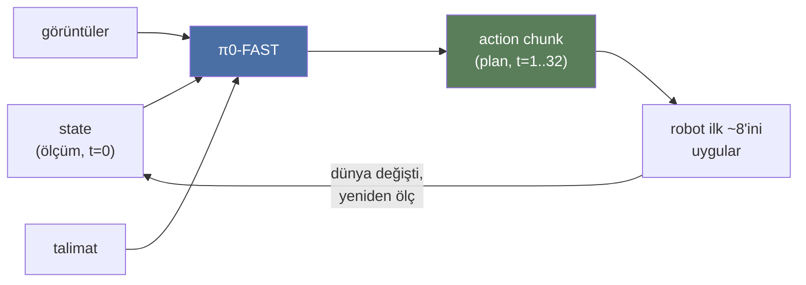
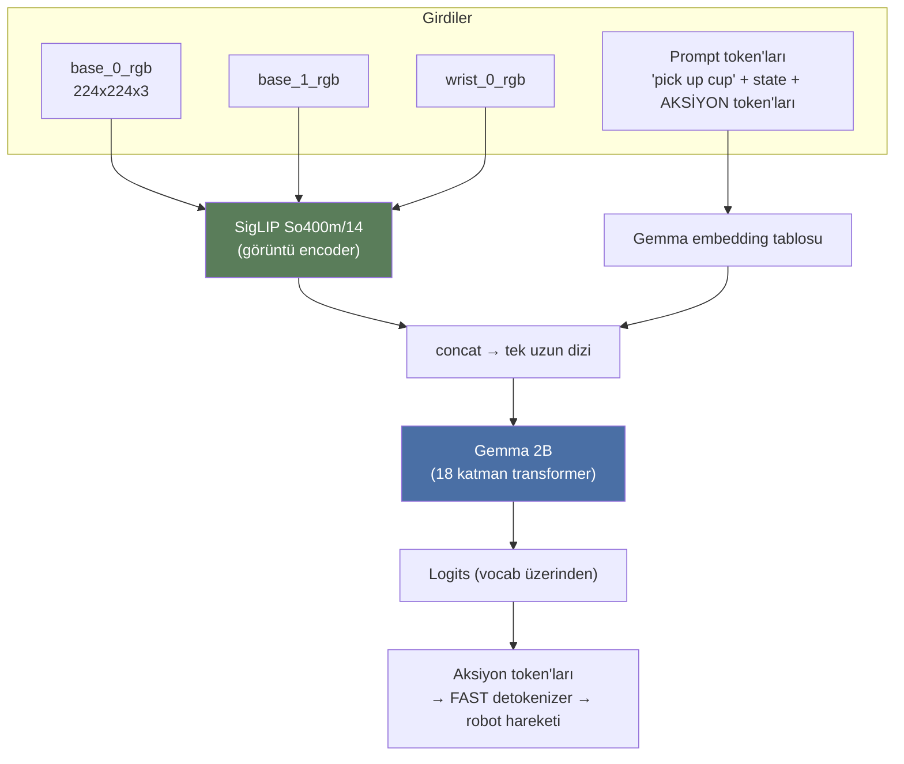
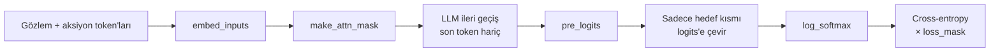
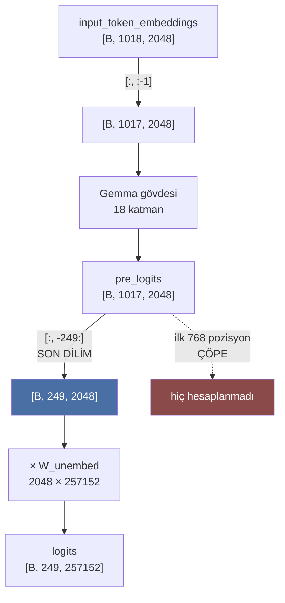
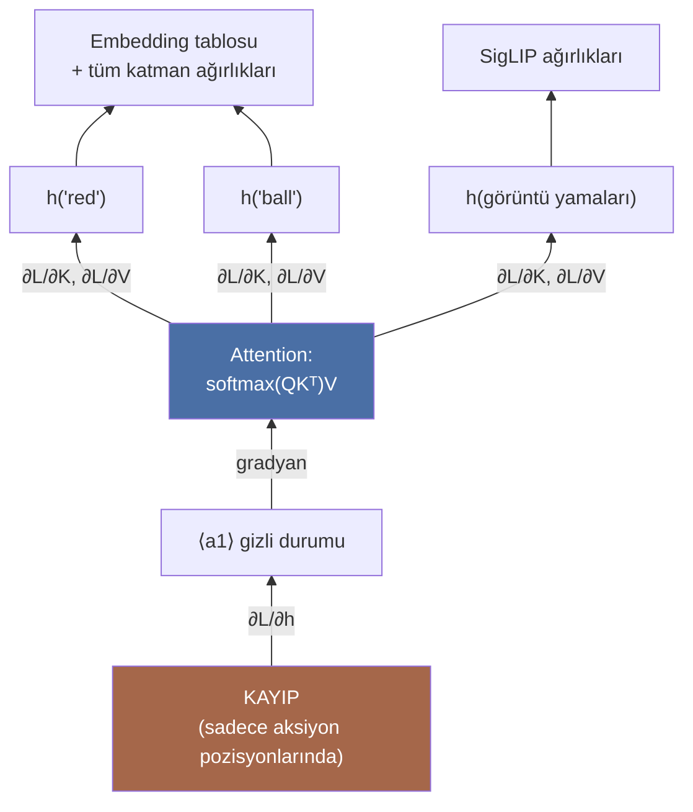
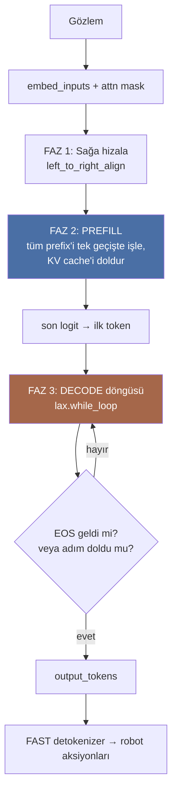
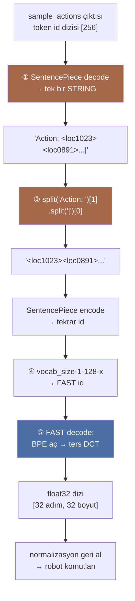
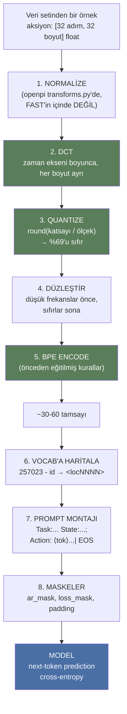
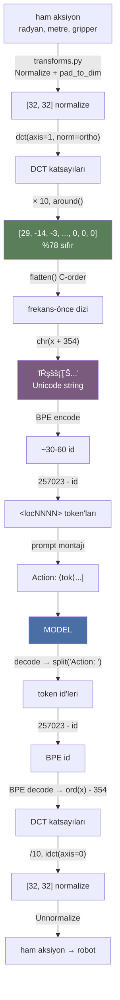

# π0-FAST (`pi0_fast.py`) — Satır Satır Açıklama

> Kaynak: [openpi/src/openpi/models/pi0_fast.py](https://github.com/Physical-Intelligence/openpi/blob/main/src/openpi/models/pi0_fast.py)
> Bu dosya bizim çalışma hafızamız. Konuştukça sorular/cevaplar en alta eklenecek.
> Son güncelleme: 2026-08-04

---

## 0. Bir cümlede π0-FAST nedir?

**Bir robot politikasını (policy), sıradan bir dil modeline çevirir.**
Kamera görüntüleri + "pick up the cup" gibi bir talimat + robotun eklem durumu içeri girer;
model **kelime üretir gibi "aksiyon token'ları" üretir**, o token'lar da robot hareketlerine geri çözülür.

Yani π0-FAST'in tamamı şu cümleye indirgenebilir:

> **Robot kontrolü = next-token prediction.**

---

## 1. Büyük resim: π0 ile π0-FAST arasındaki fark

Aynı ekip (Physical Intelligence) iki model yayınladı ve ikisi de aynı omurgayı (PaliGemma) kullanıyor.
Fark, **aksiyonun nasıl temsil edildiği**:

| | **π0** (flow matching) | **π0-FAST** (autoregressive) |
|---|---|---|
| Aksiyon temsili | Sürekli vektör (continuous) | Ayrık token'lar (discrete) |
| Nasıl üretilir | Difüzyon/flow ile 10 adımda gürültüden çözülür | LLM gibi token token üretilir |
| Ek modül | "Action expert" adında ikinci bir transformer | **Yok** — düz LLM kafası yeter |
| Eğitim kaybı | Flow matching (regresyon) | **Cross-entropy** (dil modeli kaybı) |
| Çıkarım hızı | Hızlı (sabit adım) | Daha yavaş (token sayısı kadar adım) |
| Kod karmaşıklığı | Yüksek | **Düşük** — bu dosya bu yüzden kısa |

Bu dosyada (`pi0_fast.py`) `action expert` diye bir şey **göremeyeceksin**. Çünkü yok.
Aksiyonlar dil modelinin kendi kelime dağarcığına (vocabulary) gömülmüş durumda.

---

## 2. FAST nedir? (İsmin geldiği yer)

**FAST = Frequency-space Action Sequence Tokenization**

Sorun şu: bir robot aksiyon parçası (action chunk) şöyle bir şeydir:

```
32 zaman adımı × 32 eklem/boyut = 1024 tane float sayı
```

Bunları naif şekilde token'a çevirsen (her sayıyı ayrı ayrı binlere böl → "binning"),
1024 token eder ve daha kötüsü: **ardışık değerler birbirine çok benzer**.
Model "bir sonraki token'ı tahmin et" derken hep aynı sayıyı kopyalamayı öğrenir, gerçek beceriyi öğrenmez.

FAST bunu şöyle çözer (bu dosyada değil, tokenizer tarafında olur):

```
Ham aksiyonlar  →  [1] DCT (Discrete Cosine Transform)  →  frekans katsayıları
                →  [2] Küçük katsayıları at (yuvarlama/quantize)
                →  [3] BPE ile sıkıştır (dilde kullanılan aynı algoritma)
                →  ~30-60 token
```

JPEG'in görüntüye yaptığını, FAST aksiyon dizisine yapıyor: **düzgün/yumuşak sinyali
birkaç frekans katsayısına sıkıştırıyor**. 1024 sayı → ~40 token.

> Bu yüzden config'de `fast_model_tokenizer` alanı var. Model bu tokenizer'ı doğrudan
> çağırmaz; veri hattı (data pipeline) aksiyonları token'a çevirip `tokenized_prompt`
> içine koyar. **Model sadece token görür.**

---

## 2.5 `state` ile `action` arasındaki fark ne? (aynı sayılar, farklı roller)

Bu ikisi karıştırılmaya çok müsait, çünkü **fiziksel olarak aynı şeyler**:
robotun eklem değerleri. Aynı birimler, aynı eklemler, aynı sayı aralığı.
Kodda bile aynı boyutu paylaşıyorlar:

```python
state=jax.ShapeDtypeStruct([batch_size, self.action_dim], jnp.float32),
#                                       └── action_dim! state'in kendi boyutu yok
```

Fark **fizikte değil, zamanda ve rolde.**

### 2.5.1 Tek cümlede

| | `state` | `action` |
|---|---|---|
| Soru | "Robot **şu anda** nerede?" | "Robot **bundan sonra** ne yapsın?" |
| Zaman | **Tek an** (t=0) | **32 gelecek an** (t=1..32) |
| Nereden gelir | **Sensörden ölçülür** | **Modelden tahmin edilir** |
| Şekil | `[32]` | `[32, 32]` = `[horizon, dim]` |
| Rolü | **GİRDİ** | **ÇIKTI** |

### 2.5.2 Zaman çizgisi

```
zaman ──────────────────────────────────────────────────────────►

   t=0          t=1     t=2     t=3    ...    t=32
    │            │       │       │              │
    ▼            ▼       ▼       ▼              ▼
 [ STATE ]     [a1]    [a2]    [a3]    ...   [a32]
    │          └────────── ACTION CHUNK ─────────┘
    │
 "şu anda       "bundan sonraki 32 adımda
  buradayım"     şunları yapacağım"

 ÖLÇÜLDÜ ✓      TAHMİN EDİLECEK ?
 (encoder'lar    (modelin işi)
  söyledi)
```

Yani `state` **bir fotoğraf**, `action` **bir plan**.

### 2.5.3 Benzetme: araba kullanmak

```
state   :  "Şu an direksiyon 10° sağda, gaz %30, hız 40 km/s"     ← göstergeye bakıyorsun
action  :  "Sonraki 3 saniyede direksiyonu yavaşça 25°'ye çevir,
            gazı %20'ye düşür"                                     ← yapmaya karar verdiğin şey
```

İkisi de "direksiyon açısı" cinsinden ölçülür. Biri okuduğun, diğeri yazdığın.

### 2.5.4 Peki neden farklı token'laştırılıyorlar?

9.5'te gördük: `state` düz metin (`"128 71 200"`), `action` özel token
(`<loc1023>`). **Neden aynı yöntem kullanılmıyor?** İşte asıl güzel kısım:

```
state  :   32 sayı  (tek zaman adımı)     →  sıkıştırmaya GEREK YOK
action : 1024 sayı  (32 adım × 32 boyut)  →  sıkıştırma ŞART
```

Ama asıl sebep boyut değil. 14.0'da naif binning'in neden çöktüğünü görmüştük:
ardışık değerler birbirine çok benziyor, model kopyalamayı öğreniyor.
**O problem `state` için var mı?**

> **Yok.** Çünkü `state` hiçbir zaman *tahmin edilmiyor* — `loss_mask` orada 0.
> Kopyalama problemi sadece **üretilen** token'larda ortaya çıkar.

Bunu bir tabloya dökelim, çünkü bütün tasarım bu mantıkta:

| | `state` | `action` |
|---|---|---|
| Prompt'ta yeri | prefix | postfix |
| `ar_mask` | 0 (çift yönlü) | 1 (nedensel) |
| `loss_mask` | **False** | **True** |
| Tahmin ediliyor mu? | Hayır | Evet |
| Naif binning sorun mu? | **Hayır** — sadece okunacak | **Evet** — üretilecek |
| Bu yüzden yöntem | Basit: 256 kutu + metin | Karmaşık: DCT + quantize + BPE |

**Ana fikir:** Tokenizasyonun "kalitesi" ancak o token'ları *üretmen* gerektiğinde
önemlidir. Sadece okuyacaksan en aptalca yöntem bile yeterlidir.

### 2.5.5 Kapalı döngü: action bir sonraki state'e dönüşür

Model 32 adımlık plan üretiyor ama robot genelde hepsini uygulamaz:

```
t=0   :  state okunur  →  MODEL  →  32 aksiyon üretilir
         ilk ~8 tanesi uygulanır
            ↓
t=8   :  YENİ state okunur  →  MODEL  →  yeni 32 aksiyon
         ilk ~8 tanesi uygulanır
            ↓
t=16  :  YENİ state okunur  →  ...
```

Buna **kayan ufuk (receding horizon)** denir. Neden hepsi uygulanmıyor?
Çünkü dünya değişir — nesne kayar, kavrama kaçar. Sık sık yeniden gözlem yapıp
planı tazelemek gerekir.

Yani `action` (plan) bir süre sonra `state` (ölçüm) olarak geri gelir. Aynı
sayılar, döngünün farklı yerlerinde.



---

## 3. Mimarî: kuşbakışı



İki ana blok var, ikisi birlikte **PaliGemma** deniyor:

| Bileşen | Ne yapar | Kodda nerede |
|---|---|---|
| **SigLIP So400m/14** | Her görüntüyü 256 token'a çevirir | `self.PaliGemma.img` |
| **Gemma 2B** | Bütün token'ları işler, sonraki token'ı tahmin eder | `self.PaliGemma.llm` |

### Dizi (sequence) nasıl görünüyor?

```
[ ---- 256 token ---- ][ ---- 256 ---- ][ ---- 256 ---- ][ ------ ≤250 token ------ ]
    base_0_rgb            base_1_rgb       wrist_0_rgb      talimat + state + AKSİYON
|<--------------------- PREFIX (çift yönlü) ------------->|<-- SUFFIX (nedensel) -->|
                                                            ^
                                                            burası tahmin edilecek kısım
```

Toplam ≈ 768 + 250 = **1018 token**.

### 3.1 Bu sayılar tam olarak nereden geliyor?

Dokümanda `1018`, `768`, `256`, `249`, `2048`, `257152` gibi sayılar geçiyor.
Hiçbiri keyfî değil, hepsinin bir kaynağı var. Tek tek:

#### 256 — bir görüntü kaç token eder?

```python
_siglip.Module(..., variant="So400m/14", pool_type="none", ...)
IMAGE_RESOLUTION = (224, 224)     # model.py içinde
```

Vision Transformer görüntüyü **yamalara (patch)** böler. `So400m/14` isminin
sonundaki `14`, yama boyutunun 14×14 piksel olduğunu söyler:

```
224 piksel ÷ 14 piksel = 16 yama   (bir kenarda)
16 × 16 = 256 yama                 (toplam)
```

```
  224 px
┌───┬───┬───┬ ... ┬───┐
│ 1 │ 2 │ 3 │     │16 │   ← her kare 14×14 piksel
├───┼───┼───┼ ... ┼───┤      her kare → 1 token → 2048'lik vektör
│17 │18 │19 │     │32 │
├───┼───┼───┼ ... ┼───┤      16 × 16 = 256 token
│ . │ . │ . │     │ . │
├───┼───┼───┼ ... ┼───┤
│241│   │   │     │256│
└───┴───┴───┴ ... ┴───┘
```

`pool_type="none"` kritik: 256 yamayı tek bir vektöre **özetleme**, hepsini ver.
(Sınıflandırma modelleri genelde `pool_type="gap"` ile 256'yı 1'e indirir. Robotikte
nesnenin *nerede* olduğu bilgisi lazım, o yüzden mekânsal çözünürlük korunuyor.)

#### 768 — kaç görüntü var?

```python
observation_spec = _model.Observation(
    images={"base_0_rgb": ..., "base_1_rgb": ..., "wrist_0_rgb": ...},
    ...
)
```

`inputs_spec` üç kamera tanımlıyor: iki sabit gövde kamerası + bir bilek kamerası.

```
3 kamera × 256 token = 768 görüntü token'ı
```

> ⚠️ Bu **konfigürasyona bağlı**. `embed_inputs` içindeki döngü
> `for name in obs.images:` şeklinde — yani veri hattı kaç kamera verirse o kadar.
> Tek kameralı bir kurulumda 256, iki kamerada 512 olur. `768` = varsayılan
> 3-kameralı DROID/ALOHA tipi kurulumun sayısı.

#### 250 — metin tarafı

```python
max_token_len: int = 250          # Pi0FASTConfig
```

Elle seçilmiş bir bütçe. İçine şunlar sığar:

```
[BOS] + talimat ("pick up the cup") + state token'ları + [SEP] + FAST aksiyon token'ları + [EOS] + [PAD...]
└──────────────── ar_mask = 0 (prefix) ────────────────┘ └──── ar_mask = 1 (suffix) ────┘
```

Dizi **her zaman** 250 uzunluktadır; kısa örnekler `[PAD]` ile doldurulur. Neden?
Çünkü JAX'te tensör şekilleri derleme anında sabit olmak zorunda. Değişken uzunluk
olsaydı her farklı uzunluk için baştan derleme (recompilation) gerekirdi.

#### 1018 — toplam dizi uzunluğu

```
768  (3 kamera × 256)
+250  (max_token_len)
─────
1018  pozisyon → LLM'in işlediği dizi uzunluğu
```

#### 249 ve 1017 — "eksi bir"ler

İkisi de aynı sebepten, **kaydırma (shift)**:

```
targets    = tokenized_prompt[:, 1:]        → 250 - 1 = 249
LLM girdisi = input_embeddings[:, :-1]      → 1018 - 1 = 1017
```

- `targets` bir baştan kırpılır: ilk token'ın (`BOS`) bir "öncesi" yok, hedef olamaz.
- Girdi bir sondan kırpılır: son token'ın bir "sonrası" yok, tahmin edeceği şey yok.

#### 2048 ve 257152 — Gemma 2B'nin sabitleri

| Sayı | Adı | Anlamı |
|---|---|---|
| `2048` | `width` / hidden size | Her token'ı temsil eden vektörün boyutu |
| `257152` | `vocab_size` | Kelime dağarcığı: normal kelimeler + görüntü + **FAST aksiyon token'ları** |
| `18` | katman sayısı | Gemma 2B'nin transformer blok sayısı |

`257152` neden bu kadar büyük? Yapısı şöyle:

```
256000 normal kelime  +  1024 <locNNNN>  +  128 <segNNN>  =  257152
                         └── PaliGemma'nın nesne tespiti token'ları ──┘
```

π0-FAST, aksiyon token'larını **`<locNNNN>` bölgesine** yerleştiriyor — yani modele
yeni bir çıkış kafası (head) eklenmiyor, PaliGemma'nın kullanılmayan konum
token'ları amaç değiştiriyor. Tam aritmetiği **9.5.2**'de.
FAST'in "aksiyonlar da bir dildir" fikri tam olarak bu.

#### Hepsi bir arada

```
[ 256 tok ][ 256 tok ][ 256 tok ][ ------------- 250 tok ------------- ]
 base_0     base_1     wrist_0    BOS talimat state SEP a1..an EOS PAD
└───────── 768 görüntü token'ı ─┘└──── metin + aksiyon token'ları ────┘
└────────────────────── 1018 pozisyon ──────────────────────────────┘

her pozisyon → 2048 boyutlu vektör    → tensör: [B, 1018, 2048]
kayıp sadece son 249 pozisyonda       → tensör: [B,  249, 257152]
```

---

## 4. Yardımcı fonksiyonlar

### 4.1 `make_attn_mask` — dikkat maskesi kurma

Bu fonksiyon dosyanın **en kritik ve en kafa karıştırıcı** parçası. Sakin sakin gidelim.

```python
def make_attn_mask(input_mask, mask_ar):
    mask_ar = jnp.broadcast_to(mask_ar, input_mask.shape)
    cumsum = jnp.cumsum(mask_ar, axis=1)
    attn_mask = cumsum[:, None, :] <= cumsum[:, :, None]
    valid_mask = input_mask[:, None, :] * input_mask[:, :, None]
    return jnp.logical_and(attn_mask, valid_mask)
```

**İki farklı maske var, karıştırma:**

| Maske | Ne demek |
|---|---|
| `input_mask` | "Bu pozisyon gerçek veri mi, yoksa padding (dolgu) mu?" 1 = gerçek |
| `mask_ar` | "Bu token yeni bir blok başlatıyor mu?" 1 = yeni blok, 0 = önceki blokla aynı |

**Püf noktası: `cumsum` ile blok numarası üretmek.**

`mask_ar` üzerinde kümülatif toplam alınca her token'a bir **blok kimliği** çıkıyor:

```
mask_ar :  0  0  0  1  1  1
cumsum  :  0  0  0  1  2  3     ← her token'ın "blok numarası"
```

Sonra kural şu kadar basit:

> **q token'ı, k token'ına bakabilir ⟺ blok_no[k] ≤ blok_no[q]**

Yani "benden önceki veya benimle aynı bloktakilere bakabilirim".

**Örnek 1 — saf nedensel (causal) dikkat:** `mask_ar = [1,1,1,1]` → `cumsum = [1,2,3,4]`

```
        k=0  k=1  k=2  k=3
q=0  [   ✓    ✗    ✗    ✗  ]
q=1  [   ✓    ✓    ✗    ✗  ]      klasik üçgen maske
q=2  [   ✓    ✓    ✓    ✗  ]
q=3  [   ✓    ✓    ✓    ✓  ]
```

**Örnek 2 — prefix-LM (π0-FAST'in kullandığı):** `mask_ar = [0,0,0,1,1,1]` → `cumsum = [0,0,0,1,2,3]`

```
        k=0  k=1  k=2 | k=3  k=4  k=5
q=0  [   ✓    ✓    ✓  |  ✗    ✗    ✗  ]  ┐
q=1  [   ✓    ✓    ✓  |  ✗    ✗    ✗  ]  │ PREFIX: birbirini serbestçe görür
q=2  [   ✓    ✓    ✓  |  ✗    ✗    ✗  ]  ┘ (çift yönlü / bidirectional)
     ------------------+----------------
q=3  [   ✓    ✓    ✓  |  ✓    ✗    ✗  ]  ┐
q=4  [   ✓    ✓    ✓  |  ✓    ✓    ✗  ]  │ SUFFIX: nedensel (causal)
q=5  [   ✓    ✓    ✓  |  ✓    ✓    ✓  ]  ┘
```

**Neden böyle?** Görüntüler ve talimat bir *gözlem*dir — hepsi aynı anda mevcut, birbirini
tam görmesinde sakınca yok, hatta faydalı (resmin sağı solunu bilmesi iyi).
Ama aksiyon token'ları *üretilecek* — üretirken geleceği göremez, yoksa kopya çeker.

`valid_mask` ise sadece "padding'e kimse bakmasın, padding kimseye bakmasın" diyor.

**Kodda kim ne veriyor:**

```python
ar_mask.append(0 * input_mask[-1])   # görüntü token'ları → hepsi 0 → tek büyük blok
ar_mask.append(obs.token_ar_mask)    # metin token'ları → dışarıdan gelir
```

`token_ar_mask` veri hattında şöyle kurulur: talimat + state kısmı `0`, aksiyon token'ları `1`.

---

### 4.2 `left_to_right_align` — sola dayalıyı sağa dayalı yapmak

```python
@jax.vmap
def left_to_right_align(x, input_mask, attn_mask):
    seqlen = jnp.max(input_mask * jnp.arange(input_mask.shape[0])) + 1
    x = jnp.roll(x, -seqlen, axis=0)
    ...
```

`@jax.vmap` = "bu fonksiyonu batch'teki *her örnek için ayrı ayrı* çalıştır".
Bu yüzden fonksiyonun içinde batch boyutu yok gibi davranıyoruz (`x.ndim == 2`).

**Problem:** Batch'teki her örneğin prompt uzunluğu farklı. Padding sağdaysa:

```
örnek 0:  [T T T T _ _ _ _]   (4 gerçek token)
örnek 1:  [T T T T T T _ _]   (6 gerçek token)
```

Üretime başlarken "bir sonraki token'ı nereye yazacağım?" sorusunun cevabı her örnek için farklı → JAX'te acı.

**Çözüm:** hepsini sağa daya, padding sola gitsin:

```
örnek 0:  [_ _ _ _ T T T T]
örnek 1:  [_ _ T T T T T T]
                          ^
                          herkes buradan devam ediyor → tek bir indeks!
```

`jnp.roll(x, -seqlen)` diziyi `seqlen` kadar sola kaydırır, taşan kısım başa sarar.
`seqlen` = geçerli token sayısı olduğu için gerçek token'lar tam olarak sona oturur.

`attn_mask` iki eksende birden döndürülür (`axis=(0,1)`) çünkü hem satırları (query)
hem sütunları (key) aynı miktarda kaydırmak gerekir.

> `seqlen = max(input_mask * arange) + 1` → "son geçerli token'ın indeksi + 1".
> Bu, token'ların bitişik ve sola dayalı olduğunu varsayar. Öyleler.

---

### 4.3 `put_along_last_axis` — JAX'te eksik olanı elle yazmak

```python
def put_along_last_axis(arr, indices, values):
    onehot = jax.nn.one_hot(indices, arr.shape[-1], dtype=values.dtype)
    put_mask = jnp.einsum("...i,...in->...n", jnp.ones(values.shape, jnp.int32), onehot)
    put_values = jnp.einsum("...i,...in->...n", values, onehot)
    return jnp.where(put_mask, put_values, arr)
```

NumPy'da `np.put_along_axis` var, JAX'te yok. Yaptığı iş: **"şu indekse şu değeri yaz."**

JAX'te `arr[i] = v` yazamazsın (diziler değişmez/immutable), ayrıca `i` bir *traced* değer
olduğu için (döngü içinde değişiyor) normal indeksleme derlenemez. Numara:

```
indices = [3]  →  one_hot = [0,0,0,1,0,0]   ← "3. yer" maskesi
values  = [7]  →  put_values = [0,0,0,7,0,0]
sonuç   = where(maske, put_values, arr)      ← sadece 3. eleman değişti
```

Yani "indeksleme" yerine "çarp ve seç". GPU/TPU bunu sever.

---

## 5. `Pi0FASTConfig` — model ayarları

```python
@dataclasses.dataclass(frozen=True)
class Pi0FASTConfig(_model.BaseModelConfig):
    dtype: str = "bfloat16"
    paligemma_variant: _gemma.Variant = "gemma_2b"
    action_dim: int = 32
    action_horizon: int = 32
    max_token_len: int = 250
    fast_model_tokenizer: Any | None = None
    fast_model_tokenizer_kwargs: dict[str, Any] | None = None
```

| Alan | Anlamı |
|---|---|
| `dtype: bfloat16` | 16-bit float. Yarı bellek, TPU/GPU'da hızlı, eğitimde float16'dan güvenli. |
| `paligemma_variant` | `gemma_2b` (tam) veya `gemma_2b_lora` (sadece adaptör eğitimi). |
| `action_dim: 32` | Robotun boyut sayısı. Farklı robotlar için 32'ye **sıfırla doldurulur** (padding) — tek model, çok robot. |
| `action_horizon: 32` | Tek seferde kaç zaman adımı planlanır (action chunk). |
| `max_token_len: 250` | Metin + aksiyon token'ları için üst sınır. |

`create()` modeli üretir, `inputs_spec()` ise **sadece şekil/dtype bilgisi** döner
(gerçek veri değil) — JAX `jit` derlemesi ve ağırlık ilklendirmesi için gerekli.

### `get_freeze_filter` — LoRA dondurma

```python
if "lora" in self.paligemma_variant:
    return nnx.All(nnx_utils.PathRegex(".*llm.*"), nnx.Not(nnx_utils.PathRegex(".*lora.*")))
return nnx.Nothing
```

Türkçesi: *"LLM içindeki her şeyi dondur, ADI içinde `lora` geçenler hariç."*
LoRA = büyük ağırlık matrislerinin yanına küçük düşük-ranklı matrisler ekleyip
**sadece onları** eğitmek. 2 milyar parametre yerine belki 10 milyon parametre eğitirsin.

---

## 6. `__init__` — modeli kurmak

```python
llm = nnx_bridge.ToNNX(_gemma.Module(**paligemma_config, embed_dtype=..., cache_dtype=...))
llm.lazy_init(rngs=rngs, method="init")

img = nnx_bridge.ToNNX(_siglip.Module(num_classes=paligemma_config.width,
                                      variant="So400m/14", pool_type="none",
                                      scan=True, dtype_mm=config.dtype))
img.lazy_init(next(iter(config.fake_obs().images.values())), train=False, rngs=rngs)

self.PaliGemma = nnx.Dict(llm=llm, img=img)
```

Anahtar noktalar:

- **`nnx_bridge.ToNNX`**: Gemma ve SigLIP eski `flax.linen` API'siyle yazılmış, gerisi yeni
  `flax.nnx` ile. Bu köprü ikisini konuşturuyor. Koddaki `# TODO: rewrite gemma in NNX` yorumu
  tam olarak bunu söylüyor: geçici çözüm.
- **`num_classes=paligemma_config.width`**: SigLIP'in çıkışı, Gemma'nın gizli boyutuna (2048)
  yansıtılıyor. Görüntü token'ları ile metin token'ları **aynı uzayda** olmak zorunda,
  yoksa `concatenate` anlamsız olur.
- **`pool_type="none"`**: Görüntüyü tek vektöre özetleme! 256 yama (patch) token'ının hepsini ver.
  Robotik için mekânsal detay şart — nesnenin *nerede* olduğu, *ne* olduğu kadar önemli.
- **`lazy_init`**: Ağırlıkları hemen değil, bir örnek girdi görüp şekilleri anlayınca oluştur.
  `fake_obs()` bu yüzden var: sahte bir girdiyle şekilleri tetiklemek.
- **`scan=True`**: 27 katmanı Python `for` döngüsüyle değil `jax.lax.scan` ile çalıştır →
  derleme süresi kat kat kısalır.

---

## 7. `embed_inputs` — her şeyi tek diziye çevirmek

```python
for name in obs.images:
    image_token_embeddings, _ = self.PaliGemma.img(obs.images[name], train=False)
    token_embeddings.append(image_token_embeddings)
    input_mask.append(einops.repeat(obs.image_masks[name], "b -> b s", s=image_token_embeddings.shape[1]))
    ar_mask.append(0 * input_mask[-1])
```

Görüntü başına:

| Adım | Şekil |
|---|---|
| Girdi görüntü | `[B, 224, 224, 3]` |
| SigLIP çıkışı | `[B, 256, 2048]` |
| `image_masks[name]` | `[B]` — "bu kamera bu örnekte var mı?" |
| `einops.repeat` sonrası | `[B, 256]` — tek bayrak 256 token'a kopyalanır |
| `ar_mask` | `[B, 256]`, hepsi **0** → tek çift yönlü blok |

> `image_masks` neden gerekli? Her robotta 3 kamera yok. Kamera yoksa siyah görüntü
> beslenir ama maske `False` olur, model o 256 token'a hiç bakmaz.

Sonra metin:

```python
tokenized_inputs_embeddings = self.PaliGemma.llm(obs.tokenized_prompt, embed_only=True)
```

`embed_only=True` → transformer katmanlarını çalıştırma, **sadece gömme tablosundan
(embedding table) vektörleri çek**. `[B, 250]` token id → `[B, 250, 2048]` vektör.

Çıkış: üç şey birden, hepsi `axis=1` boyunca birleştirilmiş:

```
token_embeddings : [B, 1018, 2048]
input_mask       : [B, 1018]
ar_mask          : [B, 1018]
```

---

## 8. `compute_loss` — eğitim (DETAYLI)



### 8.0 Önce oyuncak bir örnek kuralım

Gerçek boyutlarla (768 görüntü + 250 metin token'ı) kafa karışıyor. O yüzden
**küçültelim**: 4 görüntü token'ı, 8 metin token'ı olsun. Mantık birebir aynı.

```
tokenized_prompt (8 token):

prompt indeksi:    0      1       2      3       4     5     6      7
token:           [BOS] [pick]  [cup]  [SEP]   [a1]  [a2] [EOS]  [PAD]
token id:          2     651    4030   108      55    91    1      0
                 └──────── talimat ────────┘  └── AKSİYON ──┘  └dolgu┘

token_loss_mask:   0      0       0      0       1     1     1      0
token_ar_mask:     0      0       0      0       1     1     1      1
```

Üç maskeyi karıştırmamak için tekrar:

| Maske | Sorusu | Kime bakar |
|---|---|---|
| `tokenized_prompt_mask` | "Gerçek token mı, dolgu mu?" | `[1,1,1,1,1,1,1,0]` |
| `token_ar_mask` | "Geleceği görebilir mi?" | dikkat maskesi kurar |
| `token_loss_mask` | "Bunu tahmin etmeyi öğrenmeli mi?" | **kayıp** hesabı |

`token_loss_mask` yalnızca **aksiyon token'ları + EOS** üzerinde 1. Yani model
"pick up the cup" cümlesini tahmin etmeyi öğrenmeye *çalışmaz*. Bu bir dil modeli
değil, bir politika (policy). Talimat girdidir, hedef değil.

`compute_loss`'un yaptığı iş tek cümlede:

> Aksiyon token'larının her birine, kendisinden önceki her şeye bakarak ne kadar
> yüksek olasılık verdiğini ölç; olasılık düşükse ceza yaz.

---

### 8.1 Hedefleri (targets) hazırlama — satır satır

```python
targets = jax.nn.one_hot(
    observation.tokenized_prompt[:, 1:],
    self.PaliGemma.llm.module.vocab_size,
)
```

Bu tek satırda **iki ayrı iş** var. Ayıralım.

#### (a) `[:, 1:]` — kaydırma (shift)

Dil modeli şunu öğrenir: *"buraya kadar olanlara bakarak bir SONRAKİ token ne?"*
Yani pozisyon *j*'deki çıktı, pozisyon *j+1*'deki token'ı hedefler.

Bunu kodlamanın en kolay yolu diziyi bir kaydırmak:

```
girdi olarak verilen :  [BOS] [pick] [cup] [SEP] [a1] [a2] [EOS] [PAD]
                          │      │     │     │     │    │     │
                          ▼      ▼     ▼     ▼     ▼    ▼     ▼
hedef  ( [:, 1:] )   :  [pick] [cup] [SEP] [a1] [a2] [EOS] [PAD]
```

Okuma şekli: "BOS görünce `pick` de", "BOS pick görünce `cup` de",
"... [SEP] görünce `a1` de" (işte kritik olan bu), "a1 görünce `a2` de".

Buna **teacher forcing** denir: eğitimde modele kendi tahminini değil, **doğru
cevabı** girdi olarak veririz. Böylece 250 token'ın 250'si için tahmin ve
düzeltme **tek bir ileri geçişte, paralel** yapılabilir. Çıkarımda böyle bir lüks
yok (doğru cevap zaten bilinmiyor), o yüzden orada token token gidilir — bu da
eğitimin neden bu kadar hızlı, çıkarımın neden yavaş olduğunun cevabı.

`targets` uzunluğu: `8 - 1 = 7`. Genelde `max_token_len - 1 = 249`.

#### (b) `jax.nn.one_hot` — id'yi vektöre çevirme

`vocab_size = 257152` (PaliGemma'nın kelime dağarcığı). One-hot, bir tamsayıyı
"o indekste 1, geri kalanı 0" olan bir vektöre çevirir:

```
token id 55  →  [0, 0, ..., 0, 1, 0, ..., 0]
                             ↑
                          55. indeks
                 ← ── 257152 uzunluk ── →
```

**Neden gerek var?** Çünkü 8.3'te göreceğin gibi, "doğru token'ın log-olasılığını
seç" işlemi one-hot ile **çarpım** olarak yazılıyor. İndeksleme yerine çarpım
kullanmak GPU/TPU'da hem paralel hem de türevlenebilir.

Şekiller (gerçek boyutlarla, `B` = batch):

| Değişken | Şekil | Not |
|---|---|---|
| `observation.tokenized_prompt` | `[B, 250]` | tamsayı id'ler |
| `...[:, 1:]` | `[B, 249]` | kaydırılmış |
| `targets` | `[B, 249, 257152]` | one-hot |

> ⚠️ `targets` **çok büyük** bir tensör: `249 × 257152 × 4 byte ≈ 256 MB` (örnek başına!).
> Pratikte XLA bunu maddeleştirmez (materialize etmez) — `targets * logp` çarpımını
> tek bir "gather" işlemine kaynaştırır (fusion). Yani kod matematiksel olarak
> okunaklı yazılmış, derleyici verimliliği hallediyor.

---

### 8.2 İki aşamalı ileri geçiş — asıl kafa karıştıran yer

```python
# 1. AŞAMA: transformer gövdesi
pre_logits, _, _ = self.PaliGemma.llm(
    embedded_prefix=input_token_embeddings[:, :-1],
    mask=attn_mask[:, :-1, :-1],
    return_prelogits=True,
)

# 2. AŞAMA: sadece gereken dilim için son izdüşüm
logits, _ = self.PaliGemma.llm(
    pre_logits=pre_logits[:, -targets.shape[1]:],
)
```

Burada üç ayrı soru var. Tek tek.

#### Soru 1: `pre_logits` ile `logits` farkı ne?

Bir transformer'ın sonu şöyle:

```
  ... 18 katman ...
        ↓
   pre_logits          [B, S, 2048]      ← her token için 2048'lik "anlam vektörü"
        ↓
   × W_unembed         [2048 × 257152]   ← DEV matris (vocab'a izdüşüm)
        ↓
     logits            [B, S, 257152]    ← her token için, her kelimeye puan
```

`pre_logits` = son gizli durum (hidden state). `logits` = onun kelime dağarcığına
açılmış hali. Aradaki matris **modelin en büyük tek katmanı**: 2048 × 257152 ≈
527 milyon parametre. (Gemma'da bu matris embedding tablosuyla paylaşılır — "weight tying".)

`return_prelogits=True` demek: *"son çarpımı yapma, bana ham gizli durumu ver."*

#### Soru 2: Neden ikiye böldüler? (Cevap: bellek)

Diziyi düşün: **1018 pozisyon** (= 3 kamera × 256 + 250 metin; ayrıntı için bkz. **3.1**),
ama kaybı sadece **249 pozisyonda** (= 250 − 1 kaydırma) hesaplıyoruz.
Görüntü token'larının bir "hedefi" yok — onlar için logits üretmek tamamen israf.

```
Naif yol   : 1017 × 257152 × 4 byte ≈ 1.05 GB   ← her pozisyon için logits
Kodun yolu :  249 × 257152 × 4 byte ≈ 0.26 GB   ← sadece gerekenler
                                       ~4× tasarruf
```

Ve bu sadece ileri geçiş; geri yayılım (backprop) için de saklanması gerekiyor,
yani gerçek tasarruf daha da büyük. Batch 32 ile çarptığında 1 GB ile 34 GB
arasındaki fark, "sığdı" ile "OOM" arasındaki farktır.



#### Soru 3: `[:, :-1]` ve `[:, -249:]` neden tam olarak doğru hizalanıyor?

**İşte bu bölümün en önemli tablosu.** Oyuncak örnekle (4 görüntü + 8 metin = 12 token):

```
global indeks :   0    1    2    3  │   4     5      6      7     8    9    10    11
içerik        :  v0   v1   v2   v3  │ [BOS][pick] [cup] [SEP]  [a1] [a2] [EOS] [PAD]
prompt indeksi:   -    -    -    -  │   0     1      2      3     4    5     6     7
```

**Adım A — `[:, :-1]` uygulanır:** son token (global 11) girdi olarak verilmez.
Neden? Çünkü onun tahmin edeceği bir "sonraki token" yok, dizi orada bitiyor.

```
LLM'e giren   :  global 0 ... 10   →  11 pozisyon
pre_logits    :  global 0 ... 10   →  11 pozisyon
```

**Adım B — `[:, -7:]` uygulanır** (`targets.shape[1] = 7`):

```
son 7 pozisyon = global 4, 5, 6, 7, 8, 9, 10
```

**Adım C — hizalama kontrolü:**

| pre_logits (global) | = prompt idx | tahmin ettiği şey | `targets[j]` | j |
|---|---|---|---|---|
| 4 | 0 `[BOS]` | prompt idx 1 | `[pick]` | 0 |
| 5 | 1 `[pick]` | prompt idx 2 | `[cup]` | 1 |
| 6 | 2 `[cup]` | prompt idx 3 | `[SEP]` | 2 |
| **7** | **3 `[SEP]`** | **prompt idx 4** | **`[a1]`** | **3** |
| **8** | **4 `[a1]`** | **prompt idx 5** | **`[a2]`** | **4** |
| **9** | **5 `[a2]`** | **prompt idx 6** | **`[EOS]`** | **5** |
| 10 | 6 `[EOS]` | prompt idx 7 | `[PAD]` | 6 |

Tam oturuyor. **Neden şans eseri değil:** görüntü token'ları dizinin *başında*
duruyor, metin token'ları *sonunda*. `[:, :-1]` bir token kırpıyor, `targets` de
zaten `250 - 1 = 249` uzunlukta. Dolayısıyla "sondan 249 tane" almak, **tam olarak
metin bölgesinin tamamını** (ilk metin token'ından başlayarak) seçiyor.

Aritmetiği genel halde:
```
pre_logits uzunluğu = (768 + 250) - 1 = 1017
son 249 tanesi      = indeks 1017-249 = 768 ... 1016
indeks 768          = ilk metin token'ı  ✓
indeks 1016         = sondan bir önceki metin token'ı ✓
```

**Peki atılan görüntü pozisyonları bir şey kaybettiriyor mu?** Hayır. Son görüntü
token'ı (global 3) prompt idx 0'ı (`BOS`) tahmin ederdi — ama `BOS` zaten hiçbir
zaman hedef değil (`targets` prompt idx 1'den başlıyor) ve `token_loss_mask`
orada 0. Kaybedilen sinyal sıfır.

---

### 8.3 Kayıp (loss) hesabı — adım adım

```python
logp = jax.nn.log_softmax(logits, axis=-1)

loss_mask = observation.token_loss_mask[:, 1:]
token_pplx = jnp.sum(targets * logp, axis=-1)
return -jnp.sum(token_pplx * loss_mask, axis=-1) / jnp.clip(jnp.sum(loss_mask, -1), 1)
```

Dört satır, dört kavram.

#### (1) `log_softmax` — puanları log-olasılığa çevir

`logits` ham puanlardır, `[-∞, +∞]` aralığında, toplamları bir şey etmez.
`softmax` onları olasılığa çevirir; `log_softmax` da logaritmasını alır:

```
logits :  [ 2.0 , 1.0 , 0.1 ]
softmax:  [ 0.66, 0.24, 0.10 ]        ← toplam = 1
log_sm :  [-0.42, -1.43, -2.30]       ← hep negatif; 0'a yakın = iyi
```

**Neden ayrı `log` değil de `log_softmax`?** Sayısal kararlılık. `log(softmax(x))`
önce çok küçük sayılar üretip sonra log alır → `log(0) = -inf` riski.
`log_softmax` tek adımda, `max` çıkararak, taşmadan hesaplar. Her zaman bunu kullan.

Şekil: `[B, 249, 257152]`, değerler `≤ 0`.

#### (2) `jnp.sum(targets * logp, axis=-1)` — doğru token'ın skorunu seç

One-hot ile çarpıp toplamak = **indeksleme**. Küçük bir örnekle (vocab = 4):

```
doğru token id = 2

targets  (one-hot) :  [ 0    ,  0    ,  1    ,  0     ]
logp               :  [-0.42 , -1.43 , -2.30 , -3.10  ]
                       ────────────────────────────────
çarpım             :  [ 0    ,  0    , -2.30 ,  0     ]
sum(axis=-1)       :   -2.30        ← doğru token'ın log-olasılığı
```

Yani `token_pplx[b, j]` = *"model, j pozisyonunda doğru token'a ne kadar
olasılık verdi?"*, log cinsinden.

- `-0.1` → "%90 emindi" → iyi
- `-5.0` → "%0.7 verdi" → kötü, ceza büyük

> Değişkenin adı `token_pplx` (perplexity) ama içerik aslında **log-olasılık**.
> Perplexity bunun `exp(-x)`'i olurdu. İsim biraz yanıltıcı, kafan karışmasın.

Şekil: `[B, 249]`.

#### (3) `loss_mask` — sadece aksiyonlar için ceza yaz

```python
loss_mask = observation.token_loss_mask[:, 1:]
```

`targets` bir kaydırıldığı için maske de aynı şekilde kaydırılır — böylece
`loss_mask[j]`, `targets[j]`'nin karşılığı olur. Oyuncak örnekte:

```
                       prompt idx:   0    1    2    3    4    5    6    7
token_loss_mask           :          0    0    0    0    1    1    1    0
                                          └──────── [:, 1:] ────────────┘
loss_mask (j indeksli)    :               0    0    0    1    1    1    0
                            j =           0    1    2    3    4    5    6
targets[j]                :             pick  cup  SEP   a1   a2  EOS  PAD
                                                        ↑↑↑↑↑↑↑↑↑↑↑↑↑↑
                                                        sadece bunlar sayılır
```

Görüldüğü gibi maske **hedefin kendisine** göre 1/0: hedef bir aksiyon token'ı
(veya EOS) ise 1. `pick`, `cup`, `SEP` ve `PAD` tahminleri kayba **hiç girmez** —
gradyan da almazlar.

> **Neden EOS de 1?** Çünkü modelin "aksiyon parçası burada bitti" demeyi öğrenmesi
> gerek. Çıkarımda döngü EOS görünce duruyor (bkz. 9. bölüm); EOS öğretilmezse
> model hiç durmaz.

#### (4) Toplama, negatifleme, ortalama

```python
-jnp.sum(token_pplx * loss_mask, axis=-1) / jnp.clip(jnp.sum(loss_mask, -1), 1)
```

Parça parça, tek bir batch örneği için:

```
token_pplx :  [-0.9, -1.2, -0.4, -2.10, -0.55, -0.30, -4.4]
loss_mask  :  [  0 ,   0 ,   0 ,   1  ,   1  ,   1  ,   0 ]
             ────────────────────────────────────────────────
çarpım     :  [  0 ,   0 ,   0 , -2.10, -0.55, -0.30,   0 ]

sum        :  -2.95          ← maskeli toplam log-olasılık
negatif    :  +2.95          ← "negatif log-likelihood" = ceza
sum(mask)  :   3             ← kaç token sayıldı
sonuç      :  2.95 / 3 = 0.983
```

- **Neden eksi?** Log-olasılık hep negatiftir ve *büyük* olması iyidir.
  Optimize ediciler ise *küçültmeye* çalışır. Eksiyle çevirince "iyi = küçük" olur.
  Buna **negative log-likelihood** veya **cross-entropy** denir; ikisi de aynı şey.
- **Neden token sayısına bölüyoruz?** Çünkü aksiyon token sayısı örnekten örneğe
  değişir (FAST tokenizer değişken uzunluk üretir!). Bölmezsek uzun aksiyon dizisi
  olan örnekler kaybı domine eder, model onlara aşırı odaklanır. Bölünce her
  örnek eşit ağırlıkta olur.
- **`jnp.clip(..., 1)` neden?** Payda sıfır olmasın diye. Bir örnekte hiç aksiyon
  token'ı yoksa: pay zaten `0`, payda `clip(0, 1) = 1`, sonuç `0/1 = 0`. `NaN` yok.
  `NaN` bir kez oluşursa gradyanla tüm ağırlıklara bulaşır ve eğitim ölür — bu
  yüzden böyle görünüşte gereksiz sigortalar aslında hayati.

#### Özet: şekiller zinciri

```
tokenized_prompt        [B, 250]           tamsayı
   ├─[:, 1:]──────────► [B, 249]
   └─one_hot──────────► [B, 249, 257152]   = targets

input_embeddings        [B, 1018, 2048]
   ├─[:, :-1]─────────► [B, 1017, 2048]
   ├─LLM gövdesi──────► [B, 1017, 2048]    = pre_logits
   ├─[:, -249:]───────► [B,  249, 2048]
   └─unembed──────────► [B,  249, 257152]  = logits
                        [B,  249, 257152]  = logp   (log_softmax)

targets * logp, sum(-1) [B, 249]           = token_pplx
   × loss_mask, sum(-1) [B]
   ÷ token sayısı       [B]                = KAYIP (örnek başına bir sayı)
```

> Not: fonksiyonun tip imzası `at.Float[at.Array, "*b ah"]` diyor ama gerçek
> çıktı `[B]`. π0'dan (flow matching) miras kalmış bir imza; `@at.typecheck`
> uygulanmadığı için hata vermiyor. Takılma.

---

### 8.4 "Kayıp sadece aksiyonlarda ise metnin ne işi var?"

Bu, dosyanın en sık yanlış anlaşılan noktası ve cevabı tek bir ayrımda saklı:

> ## **Bir pozisyonda kayıp olmaması, oradan gradyan akmaması demek DEĞİLDİR.**

Önce gerçek veriyi görelim, sonra bu cümleyi açalım.

#### (a) Gerçek prompt neye benziyor? (`tokenizer.py`'den doğrulandı)

`FASTTokenizer.tokenize()` şunu üretiyor:

```python
prefix = f"Task: {cleaned_text}, State: {state_str};\n"
postfix = "Action: " + <FAST aksiyon token'ları> + "|" + <EOS>

ar_mask   = [0] * len(prefix) + [1] * len(postfix)
loss_mask = [False] * len(prefix) + [True] * len(postfix)
```

Somut bir örnek:

```
Task: pick up the red ball, State: 128 71 200 64 12 ...;
Action: ⟨a1⟩⟨a2⟩⟨a3⟩ ... ⟨an⟩|<eos>
└──────────── PREFIX ────────────┘└──────── POSTFIX ────────┘
   ar=0, loss=False                  ar=1, loss=True
```

Buradan çıkan iki sürpriz:

1. **`state` bir metin dizesi!** Robotun eklem açıları `[-1, 1]` aralığında
   **256 kutuya** ayrıştırılıyor (`np.digitize`) ve `"128 71 200 64"` gibi
   sıradan sayı kelimeleri olarak yazılıyor. Ayrı bir "state encoder" yok.
   Her şey metin.
2. **`"Action: "` de postfix'te**, yani `loss_mask` onda da `True`. Model bu
   iki kelimeyi üretmeyi de öğreniyor — ama bu bir formalite, 2 token.
   Anlamlı öğrenme aksiyon token'larında.

Ayrıca `_act_tokens_to_paligemma_tokens` fonksiyonu, FAST id'lerini PaliGemma
dağarcığının **nesne-tespiti konum token'ları** (`<loc0000>..<loc1023>`) bölgesine
haritalıyor. Tam aritmetiği ve neden orası olduğu **9.5.2**'de.

#### (b) O zaman kaydırma neden tüm diziye uygulanıyor?

Çünkü **kaydırma bir dilim (slice) işlemidir, seçici olamaz.**
`tokenized_prompt[:, 1:]` bütün diziyi bir kaydırır; metin kısmının hedefleri de
üretilir ama sonra `loss_mask` ile **sıfırla çarpılıp yok edilir**.

Ama asıl sebep bu değil. Asıl sebep şu:

```
prompt idx :  ...  →   17        18        19        20    ...
token      :  ...    [State]    [;\n]   ["Action:"] [⟨a1⟩]  ...
loss_mask  :  ...       0          0          1        1
                                   └─────────┐
                                             ▼
                        Bu pozisyonun ÇIKTISI ilk aksiyon token'ını tahmin eder.
```

İlk aksiyon token'ı, **prefix'in son token'ından** tahmin edilir. Yani metin ile
aksiyon arasındaki köprü tam olarak kaydırmanın sağladığı şey. Kaydırmayı sadece
aksiyon bölgesine uygulasaydın, bu sınır kaybolurdu ve "metni okuyup ilk hareketi
başlat" ilişkisi hiç kurulmazdı.

#### (c) Loss ≠ Gradyan: bağlantı tam olarak nerede kuruluyor?

İşte sorunun kalbi. Cevap tek kelime: **attention**.

Bir aksiyon token'ı, transformer'ın her katmanında kendisi *query* olur; metin ve
görüntü token'ları *key/value* olur:

```
        ⟨a1⟩ pozisyonundaki hesap:

  Q = W_q · h(⟨a1⟩)                          ← "ben ne arıyorum?"
  K = W_k · [ h(v0..v767), h(Task:), h(red), h(ball), h(State:), ... ]
  V = W_v · [   aynı token'lar   ]

  çıktı = softmax(Q·Kᵀ / √d) · V             ← metin ve görüntüden bilgi ÇEKER
```

Şimdi geri yayılıma (backprop) bakalım:



Yani:

| | Metin token'ları | Aksiyon token'ları |
|---|---|---|
| Kayıp hesaplanıyor mu? | **Hayır** (`loss_mask=0`) | Evet |
| Gradyan akıyor mu? | **EVET** (attention üzerinden) | Evet |
| Model ne öğreniyor? | Metni **okumayı** | Aksiyonu **yazmayı** |

Kısacası: model "pick up the red ball" cümlesini *üretmeyi* öğrenmiyor
(zaten gerek yok, o girdi). Ama o cümleyi **doğru aksiyona çevirmeyi** öğreniyor —
ve bunun gradyanı doğrudan `red`, `ball` token'larının temsillerine, oradan da
embedding tablosuna ve SigLIP'e kadar iniyor.

> Benzetme: Bir sınavda sadece "cevap" kutusundan puan alırsın, "soru"yu tekrar
> yazmaktan almazsın. Ama soruyu **okumadan** cevap kutusunu dolduramazsın.
> Soruyu okuma becerisi, cevaptan aldığın puanla öğrenilir.

---

## 9. `sample_actions` — çıkarım (inference)

En uzun ve en zor kısım. Üç fazı var.



### FAZ 1 — Hizalama

```python
prefix_token_embeddings, prefix_mask, prefix_attn_mask = left_to_right_align(...)
prefill_size = prefix_token_embeddings.shape[1]   # sabit, 1018
prefill_len  = jnp.sum(prefix_mask, axis=-1)      # örnek başına gerçek token sayısı
prefix_start = prefill_size - prefill_len         # gerçek token'ların başladığı indeks
```

Sağa hizalandığı için: gerçek token'lar `[prefix_start, prefill_size)` aralığında,
padding solda. Herkes aynı yerden (`prefill_size`) devam edecek.

### FAZ 2 — Prefill (KV cache doldurma)

```python
prefix_attn_mask = jnp.pad(prefix_attn_mask, ((0, 0), (0, 0), (0, max_decoding_steps)))
prefix_positions = jnp.cumsum(prefix_mask, axis=-1) - 1
prefix_logits, kv_cache, _ = self.PaliGemma.llm(
    embedded_prefix=..., mask=prefix_attn_mask, positions=prefix_positions, decode=True)
```

**KV cache nedir?** Transformer'da her token, önceki tüm token'ların Key ve Value
vektörlerine bakar. Her yeni token'da hepsini baştan hesaplamak O(n²) israf.
Bunun yerine bir kere hesaplayıp saklarsın:

```
Cache'siz:  token 500 üretilirken 500 token'ın K,V'si tekrar hesaplanır  → yavaş
Cache'li:   499'u zaten hafızada, sadece 1 yeni token hesaplanır         → hızlı
```

`jnp.pad(..., (0, max_decoding_steps))` → maskenin *key* eksenine 256 boş yer ekler.
Bu, cache'in **toplam boyutunu** belirler: `1018 + 256 = 1274`. JAX'te dizi boyutları
derleme anında sabit olmak zorunda, o yüzden en baştan yer ayrılıyor.

`positions` RoPE (döner konum gömme) için. Padding'e `-1` düşer ama zaten maskeli.

### FAZ 3 — Decode döngüsü

```python
last_logit = prefix_logits[:, -1:]
output_tokens = jnp.zeros((last_logit.shape[0], max_decoding_steps))
```

Sağa hizalamanın meyvesi burada: **son pozisyonun logiti** her örnek için doğru yerde
(çünkü hepsinin son gerçek token'ı `prefill_size - 1` indeksinde).

#### Token örnekleme

```python
token = jax.lax.cond(
    temperature > 0.0,
    lambda _: jax.random.categorical(rng_step, last_logit / temperature, axis=-1),
    lambda _: jnp.argmax(last_logit, axis=-1),
    operand=None,
)
```

- `temperature = 0.0` (varsayılan) → **greedy**, hep en olası token. Robotta genelde
  istediğin bu: tekrarlanabilir, deterministik davranış.
- `temperature > 0` → olasılıksal örnekleme. Yüksek sıcaklık = daha çeşitli/riskli.
- `jax.lax.cond` neden normal `if` değil? Çünkü bu fonksiyon `jit` ile derleniyor;
  `if` derleme anında karar verir, `lax.cond` çalışma anında. (Burada `temperature`
  aslında Python `float` olduğu için `if` de olurdu — ama `lax.cond` her durumda güvenli.)

#### Erken durdurma

```python
has_eos = jnp.any(token == PALIGEMMA_EOS_TOKEN, axis=-1)
all_eos = jnp.all(has_eos)
```

`PALIGEMMA_EOS_TOKEN = 1`. Döngü, **batch'teki herkes** bitirince durur.
Tek bir örnek erken bitse bile diğerleri devam eder (JAX'te tek tek durdurmak mümkün değil,
hepsi aynı programı çalıştırır). Bitenler çöp token üretmeye devam eder ama
detokenizer EOS'tan sonrasını atar.

#### Tek adım decode

```python
token_embedding = self.PaliGemma.llm(token, embed_only=True)
positions = prefill_len[:, None] + step + 1
mask = jnp.logical_and(
    jnp.arange(prefill_size + max_decoding_steps)[None, None, :] >= prefix_start[:, None, None],
    jnp.arange(prefill_size + max_decoding_steps)[None, None, :] < (prefill_size + step + 1),
)
last_logit, kv_cache, _ = self.PaliGemma.llm(
    embedded_prefix=token_embedding, mask=mask, positions=positions, decode=True, kv_cache=cache)
```

Maskenin anlamı, cache üzerinde bir **pencere** açmak:

```
cache indeksleri:  0 ........ prefix_start ........ prefill_size ... prefill_size+step
                   |<-- padding, BAKMA -->|<-- gerçek prefix -->|<-- üretilenler -->|
                                          |<================ BAK ==================>|
```

- Alt sınır `>= prefix_start`: sol taraftaki padding'i dışla.
- Üst sınır `< prefill_size + step + 1`: henüz üretilmemiş gelecek slotları dışla.

Yeni token her adımda cache'in bir sonraki slotuna yazılır, pencere bir birim büyür.

#### Döngü mekanizması

```python
_, _, output_tokens, _, _, _ = jax.lax.while_loop(
    cond, step, (rng, last_logit, output_tokens, kv_cache, False, 0))
```

Neden Python `while` değil? Çünkü Python döngüsü `jit` altında **açılır (unroll)** —
256 adım = 256 kopya transformer kodu = derleme cehennemi. `lax.while_loop` derlenmiş
grafikte tek bir döngü düğümü olarak kalır.

Bedeli: `carry` (taşınan durum) her adımda **aynı şekil ve dtype'ta** olmak zorunda.
`cond` fonksiyonunun skaler bool döndürme zorunluluğu da buradan.

---

## 9.5 "Aksiyonlar gerçekten metin mi?" — token'dan robot hareketine

Kısa cevap: **state metindir, aksiyonlar değildir — ama ikisi de aynı kelime
dağarcığında yaşar ve çıkarımda gerçekten bir metin turundan geçerler.**
Bu ayrım önemli, tek tek açalım.

### 9.5.1 İki farklı "metin" var, karıştırma

```
Task: pick up the red ball, State: 128 71 200 64;
      └────── GERÇEK METİN ──────┘ └─ GERÇEK METİN ─┘
Action: <loc1023><loc0891><loc0777>|<eos>
        └──── ÖZEL TOKEN'LAR ────┘
```

| | `State: 128 71 200` | `<loc1023><loc0891>` |
|---|---|---|
| Ne? | Sıradan ASCII rakamlar | Ayrılmış özel token'lar |
| Nasıl token'a çevrilir? | Normal SentencePiece | Doğrudan id ataması |
| İnsan okuyabilir mi? | Evet, `128` sayısıdır | Hayır, `<loc0891>` bir etikettir |
| Kaç token eder? | Değişken (`"200"` belki 2 token) | Her biri tam 1 token |

State, **gerçekten** metne çevriliyor: `np.digitize` ile 256 kutuya ayrıştırılıp
`" ".join(map(str, ...))` ile string yapılıyor. Yani model `"128"` yazısını
görüyor, `1`, `2`, `8` karakterlerinden oluşan bir kelimeyi.

Aksiyonlar ise **öyle değil**. Onlar id uzayında yaşıyor.

### 9.5.2 Aksiyon token'ları vocab'ın neresinde? (tam aritmetik)

```python
def _act_tokens_to_paligemma_tokens(self, tokens):
    return self._paligemma_tokenizer.vocab_size() - 1 - self._fast_skip_tokens - tokens
    #      257152                   - 1 - 128                                 - tokens
```

`_fast_skip_tokens = 128`. Hesaplayalım:

```
257152 - 1 - 128 = 257023
FAST token 0  →  257023
FAST token 1  →  257022
FAST token 2  →  257021          (geriye doğru sayıyor)
```

Peki 257023 hangi token? PaliGemma'nın kelime dağarcığının yapısı şöyle:

```
indeks           0 ... 255999  │ 256000 ... 257023 │ 257024 ... 257151
içerik      normal kelimeler   │  <loc0000>..<loc1023>  │ <seg000>..<seg127>
                               │   1024 konum token'ı   │  128 segment token'ı
                               └── PaliGemma'nın nesne tespiti için ──┘
```

- `257023 = <loc1023>` → FAST aksiyon token'ları **`<locNNNN>` bölgesine**,
  yukarıdan aşağı doğru yerleşiyor.
- `_fast_skip_tokens = 128` ise son 128'i (`<segNNN>`) **atlıyor** — onlara dokunma.

Yani π0-FAST, PaliGemma'nın *nesne tespiti için ayrılmış konum token'larını*
aksiyon token'ı olarak yeniden kullanıyor. 3.1'de "boş raflar" dediğim şeyin
tam adresi burası. Yeni parametre yok, yeni çıkış kafası yok — sadece kullanılmayan
raflar amaç değiştirmiş.

### 9.5.3 Çıkarımda gerçekten ne oluyor? (`extract_actions`)

İşte asıl sürpriz — kod **cidden bir metin turu atıyor**:

```python
def extract_actions(self, tokens, action_horizon, action_dim):
    decoded_tokens = self._paligemma_tokenizer.decode(tokens.tolist())   # ① id → STRING
    if "Action: " not in decoded_tokens:
        return np.zeros((action_horizon, action_dim), dtype=np.float32)  # ② parse hatası
    raw_action_tokens = np.array(
        self._paligemma_tokenizer.encode(
            decoded_tokens.split("Action: ")[1].split("|")[0].strip()    # ③ STRING PARSE
        )
    )
    action_tokens = self._act_tokens_to_paligemma_tokens(raw_action_tokens)  # ④ geri haritala
    return self._fast_tokenizer.decode([action_tokens.tolist()], ...)[0]     # ⑤ FAST çöz
```

Adım adım:



Yani **evet**: model çıktısı önce bir string'e çevriliyor, `"Action: "` ve `"|"`
ayraçlarına göre Python'un `split()`'iyle parse ediliyor, sonra tekrar id'ye
çevriliyor. Sorduğun "robot bunu prompt çıkışından parse edip execute mi ediyor"
sorusunun cevabı: **teknik olarak evet, aynen öyle.**

> **Bu neden çalışıyor?** `<loc0891>` gibi token'lar SentencePiece'te *kayıpsız
> gidiş-dönüş* yapar: `decode` onu `"<loc0891>"` string'ine çevirir, `encode` de
> tam olarak aynı id'ye geri döner. Bu yüzden tur zararsız.

### 9.5.4 Bu tasarımın kırılgan yeri

```python
if "Action: " not in decoded_tokens:
    return np.zeros((action_horizon, action_dim), dtype=np.float32)
```

Model `"Action: "` string'ini üretmeyi beceremezse, fonksiyon **sessizce sıfır
aksiyon döndürür** — robot hiç kıpırdamaz, hata da fırlatmaz. Üretimde bu tür
sessiz başarısızlıklar teşhis etmesi zor şeylerdir. Debug ederken akılda tutulacak
bir nokta: "robot durdu" demek illa model kötü demek değil, parse patlamış olabilir.

### 9.5.5 "Neden aksiyon için ayrı bir mekanizma yok?"

Çünkü **makalenin tezi tam olarak bu.**

| | π0 | π0-FAST |
|---|---|---|
| Ayrı aksiyon mekanizması | **Var** — "action expert" adında ikinci bir transformer | **Yok** |
| Aksiyon nasıl çıkar | Sürekli vektör, flow matching ile | Vocab üzerinden softmax |
| Ek parametre | Milyonlarca | **Sıfır** |

π0-FAST'in katkısı "aksiyon için özel bir mimari kurduk" değil, tam tersi:
**"aksiyon için özel bir mimariye gerek yokmuş"**. Aksiyonları yeterince iyi
sıkıştırırsan (FAST/DCT+BPE), sıradan bir dil modeli onları sıradan token gibi
üretebiliyor.

Bedeli ne? **Hız.** π0 sabit sayıda flow adımıyla aksiyon üretir; π0-FAST token
sayısı kadar autoregressive adım atmak zorunda. Bu yüzden gerçek zamanlı yüksek
frekanslı kontrolde π0 hâlâ avantajlı. Tasarım tercihi, üstünlük değil.

---

## 10. Eğitim vs Çıkarım — yan yana

| | `compute_loss` (eğitim) | `sample_actions` (çıkarım) |
|---|---|---|
| Aksiyon token'ları | **Girdide zaten var** (teacher forcing) | Yok, üretiliyor |
| Geçiş sayısı | 1 (paralel) | 1 prefill + N decode |
| KV cache | Yok (gerek yok) | Var (şart) |
| Hizalama | Sola dayalı, sorun değil | **Sağa dayalı** olmak zorunda |
| Maske | `make_attn_mask` tek seferde | prefill maskesi + adım adım pencere |
| Çıktı | Skaler kayıp `[B]` | Token dizisi `[B, 256]` |

---

## 11. Dikkat çeken / tartışılacak noktalar

1. **`positions` içindeki `+1`.** Prefix'in son token'ının pozisyonu `prefill_len - 1`.
   Üretilen ilk token'ın doğal olarak `prefill_len` olması beklenir, ama kod
   `prefill_len + step + 1` diyor → yani ilk üretilen token `prefill_len + 1` alıyor,
   arada bir pozisyon boş kalıyor. RoPE göreli çalıştığı için üretilen token'ların
   *kendi aralarındaki* mesafe doğru; sadece prefix ile aralarındaki mesafe bir kayıyor.
   Muhtemelen zararsız (model buna karşı gürbüz), ama eğitimle çıkarım arasında
   küçük bir tutarsızlık. **Not: bu upstream'de de böyle, doğrulandı.**

2. **`output_tokens` float olarak başlıyor** (`jnp.zeros(...)` varsayılan `float32`).
   Token id'leri float içinde taşınıyor. Küçük id'ler için kayıpsız, ama tuhaf.

3. **`compute_loss` `train` parametresini dropout için kullanmıyor** — sadece
   `preprocess_observation`'a (görüntü artırma/augmentation) geçiyor.

4. **`max_decoding_steps=256` ile `max_token_len=250` farklı şeyler.** Birincisi
   çıkarımda üretilecek token bütçesi, ikincisi eğitimdeki girdi bütçesi.

---

## 12. Kavram sözlüğü (hızlı bakış)

| Terim | Kısa karşılık |
|---|---|
| VLA | Vision-Language-Action; görüntü+dil alıp aksiyon üreten model |
| Action chunk | Tek seferde planlanan aksiyon dizisi (burada 32 adım) |
| Prefix / Suffix | Koşullandırma kısmı / üretilecek kısım |
| AR mask | Autoregressive mask; hangi token'ın geleceği görebileceği |
| Teacher forcing | Eğitimde doğru cevabı girdi olarak vermek |
| KV cache | Geçmiş token'ların Key/Value'larını saklama |
| RoPE | Rotary Position Embedding; göreli pozisyon kodlaması |
| Prefill | Prompt'un tek geçişte işlenip cache'e yazılması |
| LoRA | Düşük ranklı adaptörle ucuz ince ayar |
| DCT | Ayrık Kosinüs Dönüşümü; sinyali frekanslara ayırma |
| BPE | Byte-Pair Encoding; sık örüntüleri tek sembole sıkıştırma |

---

## 13. Dil gerçekten kullanılıyor mu? — Ezber, kısayol ve grounding

> Bu bölüm koddan değil, literatürden. Ama en kritik sorulardan biri:
> *"Sadece aksiyonlar cezalanıyorsa, model dili gerçekten anlıyor mu yoksa
> kelime kalıplarını mı ezberliyor?"*

### 13.1 Neden ezber olmak zorunda değil — bilgi-kuramsal argüman

Aynı aksiyon token dizisi, veri setinde **yüzlerce farklı görüntü ve talimatla**
eşleşiyor. "Uzan ve kavra" hareketi hem kırmızı top için hem tabak için hem tornavida
için var. Model talimatı ve görüntüyü **görmezden gelirse**, yapabileceği en iyi şey
tüm veri setindeki aksiyonların ortalama dağılımını tahmin etmektir — ki bu korkunç
bir kayıp verir.

```
Model dili/görüntüyü yok sayarsa  →  P(aksiyon) marjinal dağılım  →  kayıp YÜKSEK
Model koşullanırsa                →  P(aksiyon | görüntü, talimat) →  kayıp DÜŞÜK
```

Gradyan inişi, kaybı düşüren her yolu bulur. Koşullanmak kaybı düşürüyorsa,
model koşullanmayı öğrenir. **Cezanın nerede olduğu değil, kaybı neyin düşürdüğü önemli.**

### 13.2 Ama asıl güç robot verisinden gelmiyor — pretraining'den geliyor

Bu, çoğu kişinin kaçırdığı nokta. `red`, `ball`, `cup` token'larının embedding'leri
**sıfırdan öğrenilmiyor**. PaliGemma, milyarlarca görüntü-metin çiftiyle önceden
eğitilmiş durumda. Model robot verisini görmeden önce zaten biliyor ki:

- `red` bir renk sıfatıdır ve görüntüdeki belirli piksel bölgeleriyle ilişkilidir,
- `ball` yuvarlak bir nesnedir,
- `red ball` ile `blue ball` aynı nesnenin farklı örnekleridir.

Robot verisinin öğrettiği şey dil değil, **"bu anlamı hangi motor komutuna çevireceğim"**
eşlemesi. Bu yüzden `paligemma_variant` seçeneğinde LoRA var: LLM'i büyük ölçüde
dondurup semantiği korumak, sadece küçük adaptörlerle eşlemeyi öğretmek.

```
PaliGemma pretraining  →  "kırmızı top nedir" (semantik)      ← web ölçeği
Robot fine-tuning      →  "kırmızı topu nasıl alırım" (motor)  ← 10k saat
```

### 13.3 Senin sezgin doğru: kısayol öğrenme (shortcut learning) GERÇEK bir problem

Burada dürüst olmak gerek. VLA literatüründe belgelenmiş bir zayıflık var:
**modeller talimatı görmezden gelip sadece görüntüye bakarak da düşük kayıp
elde edebilirler.**

Mekanizma şu:

```
Sahnede tek bir nesne var  →  "topu al" / "kırmızı topu al" / "mavi topu al"
                              hepsi AYNI aksiyona gider
                           →  talimatı okumanın kayba katkısı ≈ 0
                           →  model dili yok saymayı öğrenir (bedava kısayol)
```

Bu yüzden bazı VLA değerlendirmelerinde talimatı rastgele karıştırmak (scrambling)
başarımı beklenenden çok az düşürür — model zaten dile pek bakmıyordur.

**Panzehir: çeldirici (distractor) içeren veri.** Sahnede hem kırmızı hem mavi top
varsa, doğru aksiyon **sadece** talimattan çıkarılabilir. O zaman dili okumak
kaybı düşürmenin tek yolu olur. π0'ın veri karışımının çok çeşitli olmasının
sebeplerinden biri bu.

### 13.4 Senin somut sorularının cevapları

| Senaryo | Beklenen davranış | Neden |
|---|---|---|
| "kırmızı topu al" ve "mavi topu al" ile eğitildi, **"topu al"** deniyor, sahnede tek top var | Büyük olasılıkla **çalışır** | Cümle prefix'te çift yönlü işleniyor; renk sıfatının yokluğu embedding'i bozmuyor, "ball" sinyali korunuyor |
| Aynı model, sahnede **iki top** var, "topu al" | **Belirsiz** — birini seçer, hangisi olduğu keyfî | Talimat ayırt edici bilgi içermiyor; model çoğunluk önyargısına (bias) düşer |
| **"mor topu al"**, mor hiç görülmedi | Renk ayrımı **muhtemelen kısmen** çalışır | `purple` token'ı PaliGemma'dan anlamlı geliyor; ama motor eşlemesi hiç görülmedi, bu "compositional generalization" testi |
| **"tornavidayı al"**, hiç görülmemiş nesne | Kavrama geometrisi bilinmediği için **zorlanır** | Semantiği biliyor ama o nesneye özgü motor stratejisi yok |

Genel kural: **semantik genelleme (yeni kelime/renk) motor genellemeden (yeni nesne
geometrisi) daha iyi çalışır.** Çünkü birincisi pretraining'den geliyor, ikincisi gelmiyor.

### 13.5 π0.5'in cevabı: dil kaybını geri getirmek

İlginç olan şu — senin bu sezgin, takip eden makalenin doğrudan motivasyonu.
π0.5'te model artık **hiyerarşik** çalışıyor:

```
1. adım:  Gözlem  →  METİN olarak alt görev üret     ("pick up the plate")
2. adım:  Gözlem + alt görev  →  aksiyon token'ları
```

Ve 1. adımın çıktısı **metin olduğu için, kayıp yeniden metin token'ları üzerinde
hesaplanıyor**. Yani π0-FAST'te kapatılmış olan dil kaybı, π0.5'te bilinçli olarak
geri açılıyor — tam olarak "dil anlama yeteneği körelir mi?" endişesine karşı.

Ayrıca π0.5 web verisiyle **birlikte eğitim (co-training)** yapıyor: robot verisi
ile görüntü-metin verisi aynı anda besleniyor ki dil yetisi ince ayar sırasında
unutulmasın (catastrophic forgetting'e karşı).

> **Özet:** π0-FAST'te dil kaybı yok ama dil **kullanılıyor** — attention üzerinden,
> gradyan akarak. Yine de bu tasarım kısayol öğrenmeye açık; π0.5 dil kaybını geri
> ekleyerek bunu adresliyor.

---

## 14. FAST sıkıştırması eğitimde nasıl kullanılıyor? (adım adım)

> Bu bölümdeki bütün sayılar gerçek hesaplamalardan; uydurma değil.
> DCT/quantize örnekleri numpy ile üretildi.

### 14.0 Önce problem: naif tokenizasyon neden ÇÖKÜYOR?

En basit fikir şu olurdu: her eklem açısını 256 kutuya böl, her zaman adımı için
bir token yaz. (Aslında `state` için tam olarak bunu yapıyorlar — 9.5'te gördük.)

Peki neden aksiyonlar için yapmıyorlar? Gerçek bir hesap yapalım. 32 adımlık,
50 Hz'lik yumuşak bir uzanma hareketi:

```
NAİF BINNING (32 token):
[128 136 144 149 152 154 155 157 162 168 176 184 191 197 199 200
 200 200 202 206 212 218 224 228 229 228 226 224 223 223 226 230]

ardışık farklar:
[ 8  8  5  3  2  1  2  5  6  8  8  7  6  2  1  0  0  2  4  6  6  6  4  1 -1 -2 -2 -1  0  3  4]
```

Gördün mü? **Ardışık token'lar neredeyse aynı.** Bir dil modeli için bu felakettir:

```
Model şunu öğrenir:  "önceki token 199 idi → sıradaki muhtemelen 199 veya 200"
Kayıp:               ÇOK DÜŞÜK  ✓
Öğrenilen beceri:    KOPYALAMA  ✗
```

Model kaybı düşürüyor ama hiçbir şey öğrenmiyor. Her token neredeyse **sıfır yeni
bilgi** taşıyor. Frekans arttıkça (50 Hz gibi) durum kötüleşiyor, çünkü ardışık
örnekler daha da benzer oluyor.

> Bu, FAST makalesinin çıkış noktası: naif tokenizasyonla eğitilen otoregresif VLA'lar
> yüksek frekanslı, el becerisi gerektiren (dexterous) görevlerde **öğrenemiyor**.

### 14.1 Çözüm: sinyali frekans uzayına taşı

**Ana fikir:** Zaman uzayında komşu değerler bağımlı (correlated). Frekans uzayında
değiller. DCT tam olarak bu bağımlılığı çözer (decorrelation).

Küçük bir örnekle, 8 adımlık yumuşak bir hareket:

```
ham sinyal x    : [0.000  0.200  0.390  0.561  0.704  0.811  0.877  0.900]
                   └── komşular birbirine çok yakın ──┘

DCT katsayıları : [1.571 -0.854 -0.192 -0.062 -0.040 -0.018 -0.013 -0.005]
                   └─ büyük ─┘ └──────── hızla sıfıra gidiyor ────────┘
```

Ne oldu? **Enerjinin neredeyse tamamı ilk iki katsayıya toplandı.**

| Katsayı | Anlamı |
|---|---|
| `c[0] = 1.571` | Ortalama seviye (DC) — "eklem kabaca nerede?" |
| `c[1] = -0.854` | En yavaş salınım — "genel gidiş yönü" |
| `c[2] = -0.192` | Daha hızlı bileşen — "eğrilik" |
| `c[7] = -0.005` | En hızlı titreşim — **gürültü, atılabilir** |

Bu tam olarak **JPEG'in görüntüye yaptığı şey**. JPEG de 8×8 bloklara DCT uygular,
yüksek frekansları atar, kalanı sıkıştırır. FAST bunu zaman eksenine uyguluyor.

```
ZAMAN UZAYI                       FREKANS UZAYI
                                  ▲
 ▲     ●───●───●                  │ █
 │  ●──                           │ █
 │ ●                              │ █ █
 │●                               │ █ █ ▄ _ _ _ _ _
 └──────────────►                 └──────────────────►
  32 değer, hepsi önemli           2-3 değer önemli, gerisi ≈ 0
```

### 14.2 Quantize: küçükleri sıfıra yuvarla

Katsayıları bir ölçekle **çarpıp** yuvarlıyoruz (`scale = 10`, gerçek config değeri):

```python
dct_coeff = np.around(dct_coeff * self.scale)     # scale = 10
```

32 adımlık gerçek örnekte:

```
DCT × 10, yuvarlanmış (32 katsayı):
[ 29 -14  -3  -1  -1   1   0  -2   0   0   0   0   0   0   0   0
   0   0   0   0   0   0   0   0   0   0   0   0   0   0   0   0]

sıfır sayısı            : 25 / 32  (%78)
son sıfır-dışı indeks   : 7
```

**Sonuç: dizinin son 24 elemanı tamamen sıfır.** Yüksek frekanslı bileşenler
atıldı. Ne kaybettik? Geri çözünce **maks hata 0.0375** — `[-1,1]` aralığında
yaklaşık %1.9. Robot için kabul edilebilir. Karşılığında dizinin %78'i sıfır oldu.

> **Not:** `scale` büyüdükçe hassasiyet artar ama sıfır sayısı azalır (dizi uzar).
> `scale=10` bu takasın ayar düğmesi. 16.2'de gerçek config'e bakacağız.

### 14.3 BPE: sıfır dizilerini ez

Şimdi elimizde şuna benzeyen diziler var:

```
[57, -27, -6, -1, -1, 1, -1, -3, 0, -1, 0, -1, 0, 0, 0, 0, 0, 0, ... , 0]
                                              └──── 20 tane sıfır ────┘
```

BPE (Byte-Pair Encoding), dilde kullanılan **aynı** algoritma: veri setinde sık
görülen ardışık çiftleri tek bir sembole birleştirir, tekrar tekrar.

```
adım 1:  "0 0"          çok sık görülüyor  →  yeni sembol A
adım 2:  "A A"          çok sık görülüyor  →  yeni sembol B      (= 4 sıfır)
adım 3:  "B B"          çok sık görülüyor  →  yeni sembol C      (= 8 sıfır)
...
sonuç :  20 sıfır  →  belki 2 token
```

Uzun sıfır kuyrukları BPE için mükemmel yem. Nihai sonuç:

```
1024 float sayı  (32 adım × 32 boyut)
        ↓ DCT + quantize + BPE
   ~30-60 token
```

> **Not:** BPE birleştirme kuralları (merges) **veri setinden bir kez öğrenilir**,
> her örnekte yeniden hesaplanmaz. Kodda `AutoProcessor.from_pretrained("physical-intelligence/fast")`
> ile indirilen şey bu kurallar. Yani "evrensel" bir aksiyon tokenizer'ı — çok
> sayıda robot verisi üzerinde bir kere eğitilip yayınlanmış, herkes kullanıyor.

### 14.4 Eğitimde her örnek için tam akış



**1–6. adımlar `pi0_fast.py`'de DEĞİL.** Hepsi veri hattında (`tokenizer.py` +
`AutoProcessor`) oluyor. Model dosyası hiçbir zaman float aksiyon görmüyor —
ona ulaşan tek şey `tokenized_prompt` içindeki token id'leri.

`compute_loss` imzasında `actions` parametresi var ama **gövdede hiç kullanılmıyor**:

```python
def compute_loss(self, rng, observation, actions, *, train=False):
    ...   # 'actions' bir kez bile geçmiyor
```

Çünkü aksiyonlar zaten `observation.tokenized_prompt` içine gömülmüş durumda.
Parametre sadece `BaseModel` arayüzüyle uyum için duruyor. Bu ayrıntı, "sıkıştırma
nerede kullanılıyor" sorusunun en net kanıtı: **model tarafında hiçbir yerde.**

### 14.5 Kritik nokta: tokenizer eğitilmiyor

```
Gradyan akışı:

  Cross-entropy kaybı
        ↓
  Gemma ağırlıkları        ✓ güncelleniyor
        ↓
  Embedding tablosu        ✓ güncelleniyor
        ↓
  SigLIP ağırlıkları       ✓ güncelleniyor
        ↓
  ╔═══════════════════════════════════════╗
  ║  BPE → quantize → DCT → normalizasyon ║   ✗ DUVAR
  ║  (türevlenemez, dondurulmuş)          ║
  ╚═══════════════════════════════════════╝
```

`round()` işleminin türevi her yerde sıfırdır; BPE ise tamamen ayrık bir tablo
araması. Yani **FAST tokenizer uçtan uca (end-to-end) öğrenilmiyor.** Bir kez
veri setine göre kurulup donduruluyor.

Bunun iki sonucu var:

| Artı | Eksi |
|---|---|
| Basit, kararlı, yeniden kullanılabilir | Göreve özel optimize olamıyor |
| Aynı tokenizer her robotta çalışır | Quantize hatası bir **taban sınırı** koyar |
| Eğitim tamamen standart LLM eğitimi | Model bu hatayı asla telafi edemez |

Son madde önemli: quantize sırasında atılan yüksek frekanslı bileşenler
**geri gelmez**. Model ne kadar iyi olursa olsun, üretebileceği en iyi aksiyon
tokenizer'ın çözünürlüğüyle sınırlıdır. Çok ince titreşim gerektiren bir görevde
(örneğin hassas montaj) bu bir tavan oluşturabilir.

### 14.6 Doğrulama: model dosyasında robota özgü tek satır var mı?

İddiayı test edelim. `pi0_fast.py`'deki her parçaya tek tek bakalım ve soralım:
*"bu, robotlara özgü bir şey mi?"*

| Kod parçası | Ne yapıyor | Robota özgü mü? |
|---|---|---|
| `make_attn_mask` | Prefix-LM dikkat maskesi | ✗ `big_vision`'dan alınma, genel |
| `left_to_right_align` | Batch'i sağa hizala | ✗ Genel decoding yardımcısı |
| `put_along_last_axis` | JAX'te eksik indeksleme | ✗ Genel yardımcı |
| `embed_inputs` | Görüntü + metin gömme, birleştir | ✗ Standart VLM |
| `compute_loss` | Next-token cross-entropy | ✗ **Standart LLM kaybı** |
| `sample_actions` | KV cache'li greedy/temp decoding | ✗ **Standart LLM decoding** |
| `PALIGEMMA_EOS_TOKEN = 1` | Durma token'ı | ✗ PaliGemma sabiti |

**Sonuç: hiçbiri.** Dosyada ne DCT var, ne quantize, ne aksiyon normalizasyonu,
ne özel bir kafa (head), ne de aksiyona özel bir katman.

İki tane daha çarpıcı kanıt:

```python
# 1) compute_loss'un 'actions' parametresi gövdede HİÇ kullanılmıyor
def compute_loss(self, rng, observation, actions, *, train=False):
    ...   # 'actions' bir kez bile geçmiyor

# 2) config'deki tokenizer alanları bu dosyada HİÇ okunmuyor
fast_model_tokenizer: Any | None = None
fast_model_tokenizer_kwargs: dict[str, Any] | None = None
#   ↑ sadece veri hattına taşınmak için duruyorlar
```

> Bu dosyanın adını `paligemma_prefix_lm.py` koysan, `action_dim` → `state_dim`,
> `action_horizon` → `chunk_len` diye yeniden adlandırsan **hiçbir şey bozulmaz.**
> Elimizde robotik değil, sıradan bir görsel-dil modeli var.

### 14.6.1 Ama karmaşıklık yok olmadı — yer değiştirdi

Bu önemli bir dürüstlük notu. "Ayrı mekanizma yok" demek "iş kolaylaştı" demek değil:

```
π0:        [ VLM ] + [ action expert ]        ← karmaşıklık MODELDE
                       (öğrenilir, türevlenebilir)

π0-FAST:   [ VLM ]  +  [ FAST tokenizer ]     ← karmaşıklık VERİ HATTINDA
                        (dondurulmuş, türevlenemez)
```

Mekanizma hâlâ var — DCT, quantize, BPE, vocab haritalama. Sadece **modelin
dışına**, eğitimden önce çalışan bir ön-işleme adımına taşındı.

Bunun bedeli 14.5'te anlattığımız duvar: o mekanizma öğrenilmiyor, göreve
uyarlanmıyor ve quantize hatası bir taban sınırı koyuyor. Kazancı ise modelin
tamamen standart kalması — mevcut LLM altyapısı, mevcut eğitim döngüsü,
mevcut decoding kodu olduğu gibi çalışıyor.

**Özetle:** Evet, aksiyonları öğrenen şey bildiğimiz dil modeli. Zekâ modelde,
zanaat tokenizer'da.

### 14.7 Peki π0-FAST, π0'dan daha mı iyi?

**Hayır — "daha iyi" değil, "farklı takas".** Dürüst tablo:

| Kriter | π0 (flow matching) | π0-FAST (autoregressive) |
|---|---|---|
| Mimari karmaşıklığı | Ek "action expert" transformer | **Yok — düz LLM** |
| Kayıp fonksiyonu | Flow matching (özel) | **Cross-entropy (standart)** |
| Eğitim kararlılığı | Difüzyon eğitimi hassas | **LLM eğitimi, iyi bilinen** |
| Yüksek frekanslı veri | İyi | **İyi** (FAST sayesinde) |
| **Çıkarım hızı** | **Sabit adım — hızlı** | Token sayısı kadar adım — **yavaş** |
| Gerçek zamanlı kontrol | **Avantajlı** | Zorlanır |
| Dil-görü verisiyle co-training | Zor (farklı kayıp) | **Kolay (aynı kayıp)** |

**Makalelerin rapor ettiği** (koddan değil, literatürden): π0-FAST, π0 ile
kalite olarak **karşılaştırılabilir** sonuçlar veriyor; asıl fark çıkarım hızında
ve π0-FAST birkaç kat daha yavaş. Yani π0-FAST'in katkısı "daha iyi politika"
değil, **"aynı kaliteye çok daha basit bir tarifle ulaşılabiliyor"**.

Neden bu önemli? Çünkü basitlik ölçeklenir:
- Standart CE kaybı → dil-görü verisiyle aynı anda eğitmek kolay
- Ek modül yok → mevcut LLM altyapısı olduğu gibi kullanılabilir
- Aksiyonlar vocab'da → hiçbir yeni parametre yok

**Ve son söz:** π0.5 ikisini birden kullanıyor. FAST token'ları ayrık/ön-eğitim
aşaması için, flow matching action expert ise hızlı çalışma zamanı çıkarımı için.
Yani soru "hangisi kazandı" değil; ikisi de kendi işine yarayan araçlar oldu.

---

## 15. FAST tokenizer'ın kaynak kodu: satır satır

> Bu bölüm **gerçek kaynak koddan** yazıldı, tahminle değil:
> - `huggingface.co/physical-intelligence/fast` → `processing_action_tokenizer.py`, `processor_config.json`
> - `github.com/Physical-Intelligence/openpi` → `src/openpi/models/tokenizer.py`, `src/openpi/transforms.py`
>
> ⚠️ **14. bölümdeki iki şeyi burada düzeltiyorum:** (1) ölçek **çarpan**,
> bölen değil (`scale=10`); (2) normalizasyon FAST'in içinde **değil**, openpi'nin
> transform katmanında.

### 15.1 Kod nerede yaşıyor?

Üç ayrı yerde, ve bu ayrım önemli:

```
1) openpi/src/openpi/transforms.py          → Normalize, pad_to_dim
      "ham robot birimleri → [-1,1]"
                ↓
2) openpi/src/openpi/models/tokenizer.py    → FASTTokenizer
      "prompt montajı, state binning, vocab haritalama"
                ↓
3) HF: physical-intelligence/fast           → UniversalActionProcessor
      "DCT + quantize + BPE"   ← ASIL SIKIŞTIRMA BURADA
```

3. katman **openpi'ye ait bile değil** — HuggingFace'ten `trust_remote_code=True`
ile indirilen ayrı bir paket. Toplam 6 KB'lık tek bir dosya.

### 15.2 Gerçek config değerleri

`processor_config.json` — tahmin değil, dosyanın kendisi:

```json
{
  "action_dim": null,
  "auto_map": { "AutoProcessor": "processing_action_tokenizer.UniversalActionProcessor" },
  "min_token": -354,
  "processor_class": "UniversalActionProcessor",
  "scale": 10,
  "time_horizon": null,
  "vocab_size": 2048
}
```

| Alan | Değer | Ne işe yarıyor |
|---|---|---|
| `scale` | **10** | DCT katsayıları bununla **çarpılıp** yuvarlanıyor |
| `min_token` | **-354** | Görülen en küçük quantize katsayısı — `chr()` için kaydırma |
| `vocab_size` | **2048** | BPE sözlüğü boyutu (sınıf varsayılanı 1024, config eziyor) |
| `action_dim` | `null` | Çalışma anında öğreniliyor (`decode`'a geçiliyor) |
| `time_horizon` | `null` | Aynı şekilde |

`min_token = -354`'ten çıkarım: veri setinde görülen en negatif katsayı
`-354/10 = -35.4`. Alfabe `max_token - min_token + 1` karakter, `vocab_size=2048`
sınırıyla → katsayı aralığı kabaca `[-35.4, +169]`.

### 15.3 Birimler: `state`'te ne var, `action`'da ne var?

**Kısa cevap: tokenizer birim görmüyor.** Ona gelen şey zaten normalize edilmiş
boyutsuz sayılar. Ama zincirin başında gerçek fiziksel birimler var:

```
HAM ROBOT VERİSİ                    NORMALIZE                  TOKENIZER
──────────────────                  ─────────                  ─────────
eklem açıları  [radyan]        →                          →
gripper açıklığı [0-1 veya m]  →    transforms.py         →    boyutsuz
EE pozisyonu   [metre]         →    Normalize()           →    sayılar
EE rotasyonu   [radyan/quat]   →                          →
```

**Normalizasyon iki modda** (`transforms.py`, gerçek kod):

```python
def _normalize(self, x, stats):                      # mod 1: z-score
    mean, std = stats.mean[..., :x.shape[-1]], stats.std[..., :x.shape[-1]]
    return (x - mean) / (std + 1e-6)

def _normalize_quantile(self, x, stats):             # mod 2: quantile
    q01, q99 = stats.q01[..., :x.shape[-1]], stats.q99[..., :x.shape[-1]]
    return (x - q01) / (q99 - q01 + 1e-6) * 2.0 - 1.0
```

| Mod | Formül | Aralık |
|---|---|---|
| z-score (`use_quantiles=False`) | `(x - ort) / std` | **Sınırsız!** ±4, ±6 olabilir |
| quantile (`use_quantiles=True`) | `(x - q01)/(q99-q01) * 2 - 1` | `[-1, 1]` (aykırı değerler hariç) |

> Quantile modu aykırı değerlere (outlier) dayanıklı olduğu için robot verisinde
> tercih ediliyor: tek bir bozuk kayıt `std`'yi şişirip bütün veriyi ezebilir,
> ama q01/q99'u kımıldatamaz.

**Boyut 32 nereden geliyor?** Gerçek robotların çoğunun 32 ekseni yok:

| Robot | Gerçek boyut | Ne var |
|---|---|---|
| Libero | 7 | 6 eklem + 1 gripper |
| DROID | 8 | 7 eklem + 1 gripper |
| ALOHA | 14 | 2 kol × (6 eklem + 1 gripper) |
| **model** | **32** | ← hepsi buraya **sıfırla dolduruluyor** |

```python
def pad_to_dim(x, target_dim, axis=-1, value=0.0):
    current_dim = x.shape[axis]
    if current_dim < target_dim:
        pad_width = [(0, 0)] * len(x.shape)
        pad_width[axis] = (0, target_dim - current_dim)
        return np.pad(x, pad_width, constant_values=value)
    return x
```

Yani 32 boyutun çoğu birçok robot için **sabit sıfır**. Neden? Tek model birden
çok robot gövdesini (embodiment) desteklesin diye. Yan etki güzel: sabit sıfırlar
DCT'de de sıfır kalır → BPE onları bedavaya eziyor.

**`state` binning'i** (`tokenizer.py`, kod yorumu birebir):

```python
# Convention: state gets discretized into 256 discrete bins
#             (assumed range after normalization: [-1, 1])
discretized_state = np.digitize(state, bins=np.linspace(-1, 1, 256 + 1)[:-1]) - 1
```

Dikkat: `[-1,1]` **varsayılıyor**. z-score modunda değerler bu aralığın dışına
çıkabilir; `np.digitize` onları uçlara (0 veya 255) yapıştırır. Sessiz bir kayıp.

### 15.4 `__call__` — encode, satır satır

```python
def __call__(self, action_chunk: np.array) -> np.array:
    assert action_chunk.ndim <= 3, "Only 3 dimensions supported: [batch, timesteps, action_dim]"
    if action_chunk.ndim == 2:
        action_chunk = action_chunk[None, ...]          # ① batch boyutu ekle

    self.called_time_horizon = action_chunk.shape[-2]   # ② decode için sakla
    self.called_action_dim  = action_chunk.shape[-1]

    dct_coeff = dct(action_chunk, axis=1, norm="ortho") # ③ ZAMAN ekseninde DCT
    dct_coeff = np.around(dct_coeff * self.scale)       # ④ ×10 ve yuvarla

    tokens = []
    for elem in dct_coeff:
        token_str = "".join(map(chr,                    # ⑤ UNICODE STRING (!)
            np.maximum(elem.flatten() - self.min_token, 0).astype(int)))
        tokens.append(self.bpe_tokenizer(token_str)["input_ids"])   # ⑥ BPE
    return tokens
```

| # | Ne oluyor | Not |
|---|---|---|
| ① | `[32,32]` → `[1,32,32]` | Tek örnek de batch gibi işlensin |
| ② | Şekli hatırla | `decode`'un `time_horizon`/`action_dim`'e ihtiyacı var |
| ③ | `axis=1` = **zaman** ekseni | `[batch, TIME, dim]` → doğru eksen |
| ④ | **Çarp** ve yuvarla | 14.2'deki `%78 sıfır` buradan |
| ⑤ | **Sayılar → Unicode karakter** | Aşağıda ayrı başlık, bu en tuhaf kısım |
| ⑥ | Metin BPE'si | Normal `tokenizers` kütüphanesi |

`norm="ortho"` önemli: DCT'yi **ortonormal** yapıyor, yani enerji korunuyor ve
`idct(dct(x)) == x` tam olarak sağlanıyor. Ölçek düzeltmesi gerekmiyor.

### 15.5 En tuhaf kısım: sayılar Unicode karaktere çevriliyor

Bu satır ilk bakışta anlamsız görünüyor:

```python
token_str = "".join(map(chr, np.maximum(elem.flatten() - self.min_token, 0).astype(int)))
```

Ne oluyor? **Her quantize edilmiş DCT katsayısı bir Unicode karakterine dönüşüyor.**

```
DCT×10 katsayıları :  [ 29  -14   -3   -1   -1    1    0   -2 ]
        - min_token (= -354), yani +354
kaydırılmış        :  [383  340  351  353  353  355  354  352 ]
        chr()
Unicode string     :  'ſŔşššţŢŠ'
```

Evet, gerçekten böyle bir string üretiliyor. Neden?

> **Çünkü BPE kütüphaneleri metin üzerinde çalışır.** Tekerleği yeniden icat edip
> tamsayı dizileri için BPE yazmak yerine, sayıları karaktere çevirip **hazır,
> savaş görmüş `tokenizers` kütüphanesini** olduğu gibi kullanıyorlar.

`min_token` çıkarma işleminin sebebi de bu: `chr()` negatif sayı kabul etmez.
`-354` eklenerek her şey `≥ 0` yapılıyor.

`np.maximum(..., 0)` ise bir **emniyet kelepçesi**: eğitim setinde görülmemiş,
`-354`'ten daha negatif bir katsayı gelirse `chr()` patlamasın diye 0'a kırpılıyor.
Sessizce — uyarı yok, log yok. Nadir ama gerçek bir bilgi kaybı.

### 15.6 Düzleştirme sırası: neden sıfırlar sona toplanıyor?

`elem.flatten()` — numpy varsayılanı **C order (row-major)**. Matris
`[zaman, boyut]` şeklinde olduğuna göre:

```
DCT matrisi [zaman=4, boyut=3]:      flatten() sonucu:
[[ 0  1  2]     ← frekans 0
 [ 3  4  5]     ← frekans 1          [0 1 2 | 3 4 5 | 6 7 8 | 9 10 11]
 [ 6  7  8]     ← frekans 2           └f0──┘ └f1──┘ └f2──┘ └─f3───┘
 [ 9 10 11]]    ← frekans 3
```

**Frekans-önce sıra.** Yani: önce *bütün boyutların* 0. frekansı, sonra *bütün
boyutların* 1. frekansı, ...

Bu tesadüf değil, tasarım:

```
düşük frekanslar (büyük sayılar)        yüksek frekanslar (hepsi sıfır)
├────────────────────────────┤          ├──────────────────────────────┤
[29, -14, 8, 3, ...]                    [0, 0, 0, 0, 0, 0, ... , 0, 0, 0]
                                         └──── BPE bunu ezip geçiyor ────┘
```

Eğer boyut-önce düzleştirilseydi sıfırlar araya serpiştirilirdi ve BPE bu kadar
iyi sıkıştıramazdı. Tek bir `.flatten()` çağrısı, ama sıkıştırmanın belkemiği.

### 15.7 `decode` — geri dönüş

```python
def decode(self, tokens, *, time_horizon=None, action_dim=None):
    self.time_horizon = time_horizon or self.time_horizon or self.called_time_horizon
    self.action_dim   = action_dim   or self.action_dim   or self.called_action_dim
    ...
    for token in tokens:
        try:
            decoded_tokens = self.bpe_tokenizer.decode(token)                    # ① BPE aç
            decoded_dct_coeff = np.array(list(map(ord, decoded_tokens))) + self.min_token  # ② ters chr()
            decoded_dct_coeff = decoded_dct_coeff.reshape(-1, self.action_dim)   # ③ matrise
            assert decoded_dct_coeff.shape == (self.time_horizon, self.action_dim), ...
        except Exception as e:
            print(f"Error decoding tokens: {e}")
            decoded_dct_coeff = np.zeros((self.time_horizon, self.action_dim))   # ④ SIFIR
        decoded_actions.append(idct(decoded_dct_coeff / self.scale, axis=0, norm="ortho"))  # ⑤ ters DCT
    return np.stack(decoded_actions)
```

Encode'un tam aynadaki hâli:

| Encode | Decode |
|---|---|
| `dct(..., axis=1, norm="ortho")` | `idct(..., axis=0, norm="ortho")` |
| `* self.scale` | `/ self.scale` |
| `chr(x - min_token)` | `ord(x) + min_token` |
| `.flatten()` | `.reshape(-1, action_dim)` |
| BPE encode | BPE decode |

`axis` farkı (`1` vs `0`) sadece batch boyutundan: encode `[batch,time,dim]`
alıyor, decode döngü içinde tek örnekle `[time,dim]` çalışıyor.

**③'teki `reshape` neden kritik:** `time_horizon` ve `action_dim` **token'ların
içinde yazmıyor.** Dışarıdan verilmek zorunda. Yanlış `action_dim` verirsen
kod patlamaz — sayıları yanlış matrise dizer ve **anlamsız ama geçerli görünen**
bir aksiyon üretir. `assert` bunun bir kısmını yakalıyor, hepsini değil.

### 15.8 `fit` — tokenizer bir kere nasıl kuruldu?

Bu fonksiyon eğitimde değil, **tokenizer'ı yaratırken bir kez** çalıştı:

```python
@classmethod
def fit(cls, action_data, scale=10, vocab_size=1024, *, time_horizon=None, action_dim=None):
    dct_tokens = [dct(a, axis=0, norm="ortho").flatten() for a in action_data]   # ① tüm veriye DCT

    max_token = int(np.around(np.concatenate(dct_tokens) * scale).max())         # ② aralığı bul
    min_token = int(np.around(np.concatenate(dct_tokens) * scale).min())
    min_vocab_size = max_token - min_token
    assert min_vocab_size <= vocab_size, ...

    def _token_iter():                                                          # ③ string üret
        for tokens in dct_tokens:
            rounded_tokens = (np.around(tokens * scale) - min_token).astype(int)
            yield "".join(map(chr, rounded_tokens))

    bpe = ByteLevelBPETokenizer()
    alphabet = [chr(i) for i in range(max_token - min_token + 1)]               # ④ alfabe = tüm aralık
    trainer = BpeTrainer(vocab_size=vocab_size, min_frequency=2, show_progress=True,
                         special_tokens=[], initial_alphabet=alphabet, max_token_length=10000)
    bpe._tokenizer.train_from_iterator(_token_iter(), trainer=trainer)          # ⑤ BPE eğit
    return cls(PreTrainedTokenizerFast(tokenizer_object=bpe, ...), scale=scale, ...)
```

Kritik ayrıntılar:

- **④ `initial_alphabet`**: mümkün olan *bütün* katsayı değerleri baştan alfabeye
  konuyor. Böylece eğitimde hiç görülmemiş bir katsayı gelse bile `<unk>` olmuyor.
  Bu yüzden `min_token = -354` config'e yazılmış — alfabenin sıfır noktası.
- **⑤ `max_token_length=10000`**: bir BPE token'ı 10000 karaktere kadar birleşebilir.
  Uzun sıfır kuyruklarının tek token'a inmesi bu sayede mümkün.
- **`min_frequency=2`**: en az 2 kez görülen çiftler birleştiriliyor.
- Yorum satırı dürüst: `ByteLevelBPETokenizer.train_from_iterator()` özel alfabeyi
  desteklemediği için içteki `bpe._tokenizer`'a doğrudan iniyorlar (private API).

`physical-intelligence/fast`, bu `fit`'in çok sayıda robot veri setiyle bir kez
çalıştırılmış çıktısı. `tokenizer.json` (687 KB) o öğrenilmiş birleştirme kuralları.

### 15.9 Baştan sona tam tur



### 15.10 Kırılgan noktalar (kodda gerçekten var)

Üç ayrı yerde **sessiz sıfır dönüşü** var. Hiçbiri istisna fırlatmıyor:

| Nerede | Koşul | Sonuç |
|---|---|---|
| `tokenizer.py::extract_actions` | Çıktıda `"Action: "` yok | `np.zeros(...)` → robot durur |
| `processing_action_tokenizer.py::decode` | `reshape`/`assert` patlar | `np.zeros(...)` → robot durur |
| `processing_action_tokenizer.py::__call__` | Katsayı `< min_token` | `np.maximum(...,0)` → sessizce kırpılır |

Bir de iki **varsayım**:

- `state`'in `[-1,1]` içinde olduğu varsayılıyor (`np.digitize`); z-score modunda
  değilse uçlara yapışıyor.
- `decode`, `action_dim`'i dışarıdan alıyor; yanlışsa hata vermeden yanlış
  matris kuruyor.

> Debug ederken: "robot kıpırdamıyor" mesajı gelirse ilk bakılacak yer model
> değil, bu üç `zeros` yolu. `decode` en azından `print` atıyor — ama `logging`
> değil `print`, yani üretimde kaybolabilir.

---

## 16. Soru–Cevap Günlüğü

> Buraya konuştukça ekleyeceğiz.

### S1 — (2026-08-04) `pi0_fast.py`'yi baştan sona anlat.
**C:** Yukarıdaki 1–12. bölümler.

### S2 — (2026-08-04) 8.1 / 8.2 / 8.3'ü tam anlamadım, daha açık anlat.
**C:** 8. bölüm baştan yazıldı. Eklenenler:
- **8.0**: 4 görüntü + 8 metin token'lık oyuncak örnek, üç maskenin (`prompt_mask`,
  `ar_mask`, `loss_mask`) farkı tablo halinde.
- **8.1**: `[:, 1:]` kaydırması ve `one_hot` ayrı ayrı; teacher forcing'in
  eğitim/çıkarım hız farkını neden yarattığı; `targets`'ın 256 MB'lik boyutu ve
  XLA fusion notu.
- **8.2**: `pre_logits` vs `logits` ayrımı (unembed matrisi 2048×257152);
  bellek hesabı 1.05 GB → 0.26 GB; **hizalama tablosu** — `[:, :-1]` ve `[:, -249:]`
  dilimlerinin neden tam oturduğunun global-indeks ispatı; atılan görüntü
  pozisyonlarının sinyal kaybettirmediği.
- **8.3**: `log_softmax`'ın sayısal kararlılık gerekçesi; one-hot çarpımının
  neden "seçme" demek olduğu (vocab=4'lük mini örnek); `loss_mask`'ın hedefe göre
  hizalanması ve EOS'un neden maskede 1 olduğu; eksi işaretinin, token sayısına
  bölmenin (FAST değişken uzunluk üretiyor!) ve `clip(...,1)`'in gerekçeleri;
  uçtan uca şekil zinciri.

### S3 — (2026-08-04) "1018 pozisyon, 249 pozisyonda kayıp" — bu sayılar nereden geliyor?
**C:** Yeni **3.1** bölümü eklendi: her sabitin kaynağı koddan türetildi.
Kısaca: `224 px ÷ 14 px yama = 16`, `16² = 256` token/görüntü → `3 kamera × 256 = 768`;
`+ max_token_len 250` → **1018**. `249 = 250 − 1` (targets kaydırması),
`1017 = 1018 − 1` (girdi kaydırması). Ayrıca `2048` = Gemma hidden size,
`257152` = vocab (FAST aksiyon token'ları bu dağarcığın boş raflarına yerleşiyor).
Not: `768` konfigürasyona bağlı — `embed_inputs` `for name in obs.images:` ile
döndüğü için kamera sayısı kadar değişir.

### S4 — (2026-08-04) Kayıp sadece aksiyonlarda ise metnin ne işi var? Bağlantı nerede kuruluyor? Model kelime kalıplarını ezberlemez mi?
**C:** Yeni **8.4** ve **13.** bölümleri.
- Evet, kayıp sadece postfix'te (`tokenizer.py`'den doğrulandı: `loss_mask =
  [False]*len(prefix) + [True]*len(postfix)`).
- Gerçek prompt formatı: `"Task: {talimat}, State: {256 kutuya ayrıştırılmış
  eklem açıları};\nAction: ⟨a1⟩...⟨an⟩|<eos>"` — **state de metin!**
- **Ana kavram: kayıp ≠ gradyan.** Metin pozisyonlarında kayıp yok ama attention
  üzerinden gradyan akıyor. Model metni *yazmayı* değil *okumayı* öğreniyor.
- Bağlantı noktası: aksiyon token'ı = query, metin/görüntü = key/value.
- Kaydırmanın asıl sebebi: ilk aksiyon token'ı prefix'in **son** token'ından
  tahmin ediliyor — köprü tam orada.
- Ezber endişesi **haklı**: sahnede tek nesne varsa dili okumanın kayba katkısı
  sıfır → kısayol öğrenme. Panzehir çeldiricili veri. π0.5 bu yüzden dil kaybını
  geri getiriyor (hiyerarşik alt-görev tahmini + web verisiyle co-training).

### S5 — (2026-08-04) Tüm aksiyonlar metin olarak mı üretiliyor? Robot prompt çıkışını parse edip mi çalıştırıyor?
**C:** Yeni **9.5** bölümü. Özet:
- **State metindir** (`"128 71 200"` — gerçek ASCII rakamlar, normal SentencePiece).
  **Aksiyonlar metin değildir** — `<locNNNN>` özel token'larıdır.
- Tam adres: `vocab_size - 1 - 128 - fast_id` → `257023 = <loc1023>`'ten geriye.
  Yani PaliGemma'nın **nesne tespiti konum token'ları** aksiyon olarak yeniden
  kullanılıyor. `_fast_skip_tokens=128` son 128 `<segNNN>`'i atlıyor.
- **Ama evet, çıkarımda gerçek bir metin turu var:** `extract_actions` çıktıyı
  string'e decode ediyor, `split("Action: ")[1].split("|")[0]` ile **Python
  `split()`'iyle parse** ediyor, tekrar encode ediyor, sonra FAST decode
  (BPE aç → ters DCT) ile `[32, 32]` float diziye çeviriyor.
- Kırılganlık: `"Action: "` string'i çıktıda yoksa fonksiyon **sessizce sıfır
  aksiyon** döndürüyor — robot durur, hata fırlamaz.
- "Neden ayrı mekanizma yok?" → Makalenin tezi bu. π0'da action expert **var**;
  π0-FAST onu kaldırabildiğini gösteriyor. Bedeli: hız (autoregressive adımlar).

### S6 — (2026-08-04) π0-FAST, π0'dan daha iyi diyebilir miyiz? Sıkıştırma eğitimde nasıl kullanılıyor?
**C:** Yeni **14.** bölüm (sayılar numpy ile gerçekten hesaplandı).
- **Naif binning neden çöküyor:** 32 adımlık örnekte ardışık token farkları
  `[8 8 5 3 2 1 2 ...]` — komşular neredeyse aynı → model kopyalamayı öğrenir,
  kayıp düşük ama beceri sıfır.
- **DCT:** enerjiyi ilk 2-3 katsayıya topluyor (`[1.571, -0.854, -0.192, ..., -0.005]`).
- **Quantize:** 32 katsayının **%69'u sıfır**, son 20'si tamamen sıfır;
  geri çözümde maks hata sadece 0.024.
- **BPE:** sıfır kuyruklarını eziyor → 1024 float ≈ 30-60 token.
- **Model tarafında sıkıştırma YOK:** 1–6. adımlar tamamen veri hattında.
  Kanıt: `compute_loss(..., actions, ...)` içinde `actions` **bir kez bile
  kullanılmıyor** — aksiyonlar zaten `tokenized_prompt`'ta.
- **Tokenizer eğitilmiyor:** `round()` türevlenemez, BPE ayrık → gradyan orada
  duruyor. Quantize hatası model için bir **taban sınırı**.
- **"Daha iyi mi?" → Hayır, farklı takas.** Kalite karşılaştırılabilir; π0-FAST
  daha basit (ek modül yok, standart CE), π0 daha hızlı (sabit adım). π0.5
  ikisini birden kullanıyor.

### S7 — (2026-08-04) `state` ile `action` arasındaki fark ne ki?
**C:** Yeni **2.5** bölümü. Özet:
- Fiziksel olarak **aynı şey** — aynı eklemler, aynı birimler. Kodda bile
  `state` boyutu `action_dim`'den geliyor. Fark zamanda ve rolde.
- `state` = **tek an** (t=0), sensörden **ölçülür**, `[32]`, **GİRDİ**.
  `action` = **32 gelecek an** (t=1..32), modelden **tahmin edilir**,
  `[32, 32]`, **ÇIKTI**. Fotoğraf vs plan.
- **Neden farklı token'laştırılıyorlar?** Asıl sebep boyut değil:
  naif binning'in "model kopyalamayı öğrenir" problemi **sadece üretilen**
  token'larda var. `state` hiç tahmin edilmediği için (`loss_mask=False`)
  en aptal yöntem bile yeterli. Tokenizasyon kalitesi ancak o token'ları
  *üretmen* gerektiğinde önemli.
- **Kapalı döngü:** robot 32 aksiyonun ilk ~8'ini uygular, sonra yeniden gözlem
  yapar (kayan ufuk / receding horizon). Yani `action` bir süre sonra `state`
  olarak geri gelir.

### S8 — (2026-08-04) Yani ayrı bir mekanizma yok, bildiğimiz dil modeli aksiyonları öğreniyor?
**C:** Evet, doğru. Yeni **14.6** bölümünde koddan doğrulandı: `pi0_fast.py`'deki
her parça (`make_attn_mask`, `left_to_right_align`, `compute_loss`,
`sample_actions`) tamamen genel LLM kodu — dosyada DCT yok, quantize yok, aksiyona
özel katman/kafa yok. İki çarpıcı kanıt: `compute_loss`'un `actions` parametresi
gövdede hiç kullanılmıyor, ve config'deki `fast_model_tokenizer` alanları bu
dosyada hiç okunmuyor (sadece veri hattına taşınıyorlar).
**Ama:** karmaşıklık yok olmadı, **yer değiştirdi** — π0'da action expert
modeldeydi (öğrenilir), π0-FAST'te FAST tokenizer veri hattında (dondurulmuş,
türevlenemez). Zekâ modelde, zanaat tokenizer'da.

### S9 — (2026-08-04) Tokenizer'ı öğrenelim: birimler ne, DCT nasıl alınıyor, encode/decode nasıl?
**C:** Yeni **15.** bölüm, tamamen gerçek kaynak koddan
(HF `physical-intelligence/fast/processing_action_tokenizer.py` + `processor_config.json`,
openpi `tokenizer.py` + `transforms.py`). Öne çıkanlar:
- **14. bölümde iki hatam düzeltildi:** `scale` **çarpan** (`*10`), bölen değil;
  normalizasyon FAST'in içinde **değil**, openpi `transforms.py`'de.
- **Gerçek config:** `scale=10`, `min_token=-354`, `vocab_size=2048`.
- **Birimler:** tokenizer birim görmüyor. Ham veri radyan/metre/gripper →
  `Normalize` (quantile `[-1,1]` veya z-score **sınırsız**) → `pad_to_dim` ile
  32'ye sıfır dolgu (Libero 7, DROID 8, ALOHA 14 → hepsi 32).
- **En tuhaf detay:** quantize katsayılar `chr()` ile **Unicode karaktere**
  çevriliyor (`[29,-14,...] → 'ſŔşššţŢŠ'`), çünkü BPE kütüphaneleri metin ister.
  `min_token` çıkarma sebebi: `chr()` negatif kabul etmez.
- **`.flatten()` C-order = frekans-önce** → sıfırlar doğal olarak sona toplanıyor.
  Sıkıştırmanın belkemiği, tek satır.
- **`fit()`** bir kez çalıştırılmış; `initial_alphabet` tüm katsayı aralığını
  kapsıyor (hiç `<unk>` yok), `max_token_length=10000` uzun sıfır kuyruklarını
  tek token'a indiriyor.
- **3 sessiz sıfır yolu** var (15.10) — "robot kıpırdamıyor" debug'ında ilk bakılacak yer.

---
