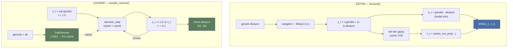
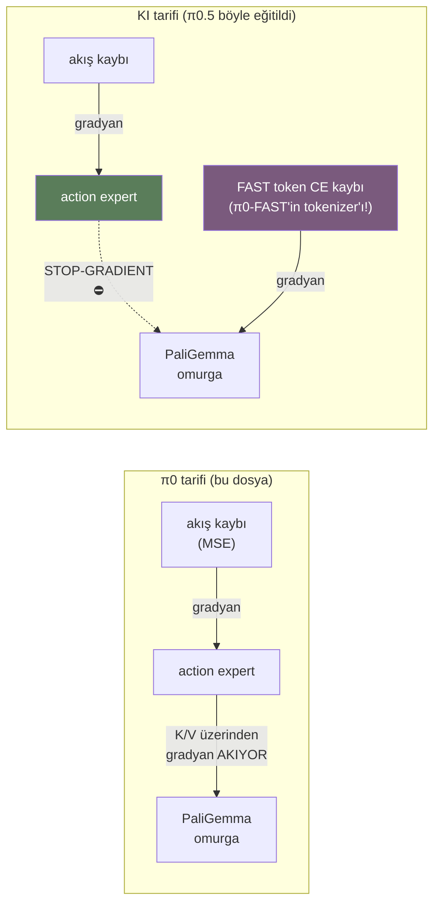

# π0 (PyTorch) — `pi0_pytorch.py` satır satır

> **Kaynak:** `github.com/Physical-Intelligence/openpi` →
> `src/openpi/models_pytorch/pi0_pytorch.py` (462 satır)
> Dosya birebir indirilip okundu; buradaki bütün satır numaraları gerçek.
> Diyagramlardaki sayısal davranışlar (akış yönü, döngü adımları, dikkat maskesi,
> zaman dağılımı) numpy ile **çalıştırılarak doğrulandı**, tahmin değil.
>
> Kardeş dokümanlar: `../pi0_fast/pi0_fast_notes.md` (π0-FAST),
> `../pi05/pi05_notes.md` (π0.5 + config değerleri).
>
> ⚠️ **DÜZELTME (2026-08-04):** Bu dokümanda aksiyon parçasını yer yer
> `[32 adım, 32 boyut]` diye örnekledim. `action_dim = 32` doğru, ama
> `Pi0Config.action_horizon` varsayılanı **50**'dir — doğrusu `[50, 32]`,
> kayıp şekli `[B, 50, 32]`, π0'ın suffix uzunluğu `1 + 50 = 51`.
> Anlatılan mekanizmaların hiçbiri değişmiyor, sadece sayı. Kaynak:
> `pi0_config.py`. (π0-FAST'te `action_horizon = 32` — o doküman doğruydu.)

---

## 1. Önce büyük resim: bu dosya π0-FAST'in tam zıddı

π0-FAST notlarında şu sonuca varmıştık: *"ayrı bir mekanizma yok, bildiğimiz dil
modeli aksiyonları öğreniyor."*

**Bu dosya o ayrı mekanizmanın ta kendisi.**

| | π0-FAST (`pi0_fast.py`) | π0 (`pi0_pytorch.py`) |
|---|---|---|
| Aksiyon temsili | Ayrık token (`<locNNNN>`) | **Sürekli vektör** (float) |
| Üretim şekli | Autoregressive, tek tek | **Hepsi aynı anda**, iteratif arıtma |
| Kayıp | Cross-entropy | **MSE** (akış eşleme) |
| Ekstra ağ | Yok | **Action expert** (2. transformer) |
| Tokenizer | FAST (DCT+BPE) | **Hiç yok** |
| Çıkarım adımı | Token sayısı kadar (değişken) | **Sabit 10** |
| Aksiyonlar birbirini görür mü | Hayır (nedensel) | **Evet (çift yönlü)** |

Burada DCT yok, BPE yok, `chr()` hilesi yok, vocab haritalama yok. Aksiyonlar
hiçbir zaman ayrıklaştırılmıyor — baştan sona float kalıyorlar.

---

## 2. Dosya haritası

```
satır   ne
─────   ──────────────────────────────────────────────────
 1-11   import'lar
14-22   get_safe_dtype          → CPU'da bfloat16 yok
25-42   create_sinusoidal_pos_embedding → zamanı vektöre çevir
45-49   sample_beta             → eğitim zamanı örnekleme
52-81   make_att_2d_masks       → cumsum dikkat maskesi hilesi
─────   class PI0Pytorch ───────────────────────────────────
84-125  __init__                → iki uzman + projeksiyonlar
127-155 gradient checkpointing  → bellek optimizasyonu
157-171 yardımcılar             → 4D maske, ön işleme
173-185 sample_noise/sample_time
187-236 embed_prefix            → görüntü + dil  → PaliGemma
238-315 embed_suffix            → state + aksiyon + zaman → Expert
317-374 forward                 → EĞİTİM (MSE kaybı)
376-420 sample_actions          → ÇIKARIM (Euler döngüsü)
422-462 denoise_step            → tek arıtma adımı
```

---

## 3. Önce teori: akış eşleme (flow matching) 5 dakikada

Kodun anlamlı olması için bu şart. Fikir basit:

**Gürültüden temiz aksiyona giden düz bir yol çiz, modele o yolun yönünü sor.**

```
t=1                                                    t=0
GÜRÜLTÜ ●────────────────────────────────────────────● AKSİYON
        └──────────── düz çizgi ─────────────────────┘
                          ↑
              model burada "hangi yöne gideyim?"
              sorusunun cevabını öğreniyor
```

Kodda (satır 328-329):

```python
x_t = time_expanded * noise + (1 - time_expanded) * actions   # yolun üzerindeki nokta
u_t = noise - actions                                          # yolun yönü (hız)
```

⚠️ **Dikkat: konvansiyon klasik difüzyonun tersi.** Doğrulanmış:

```
t=0.00:  x_t = 0.00*gürültü + 1.00*aksiyon    ← TEMİZ
t=0.25:  x_t = 0.25*gürültü + 0.75*aksiyon
t=0.50:  x_t = 0.50*gürültü + 0.50*aksiyon
t=0.75:  x_t = 0.75*gürültü + 0.25*aksiyon
t=1.00:  x_t = 1.00*gürültü + 0.00*aksiyon    ← SAF GÜRÜLTÜ
```

Çoğu difüzyon makalesinde `t=0` gürültüdür. Burada **`t=1` gürültü, `t=0` temiz**.
Kodu okurken sürekli buna takılıyorsun, bir kez oturtmak lazım.

`u_t` neden `noise - actions`? Çünkü `x_t`'nin `t`'ye göre türevi tam olarak bu:

```
x_t = t·noise + (1-t)·actions
dx_t/dt = noise - actions        ← sabit! yol düz olduğu için
```

Model `v_t` tahmin ediyor, kayıp `MSE(u_t, v_t)`. Yani **model yolun yönünü
öğreniyor**, aksiyonun kendisini değil.

Çıkarımda: gürültüden başla, tahmin edilen yönde küçük adımlar at, `t=0`'a in.

---

## 4. Yardımcı fonksiyonlar (satır 14-81)

### 4.1 `get_safe_dtype` (14-22)

```python
def get_safe_dtype(target_dtype, device_type):
    if device_type == "cpu":
        if target_dtype == torch.bfloat16:
            return torch.float32          # CPU'da bfloat16 yok
        if target_dtype == torch.float64:
            return torch.float64
    return target_dtype
```

Sıkıcı ama gerekli: CPU'da `bfloat16` desteklenmiyor, sessizce `float32`'ye
düşülüyor. Sadece `create_sinusoidal_pos_embedding` içinde kullanılıyor.

### 4.2 `create_sinusoidal_pos_embedding` (25-42) — zamanı vektöre çevirmek

Model'e `t = 0.3` diye tek bir sayı veremezsin; transformer vektör ister.
Çözüm: Transformer'ın klasik pozisyon kodlaması, ama pozisyon yerine **zaman**.

```python
fraction = torch.linspace(0.0, 1.0, dimension // 2, dtype=dtype, device=device)
period   = min_period * (max_period / min_period) ** fraction    # log-uzayda periyotlar

scaling_factor = 1.0 / period * 2 * math.pi
sin_input = scaling_factor[None, :] * time[:, None]              # dış çarpım
return torch.cat([torch.sin(sin_input), torch.cos(sin_input)], dim=1)
```

Ne oluyor:

```
tek sayı t=0.3
      ↓
farklı frekanslarda sin/cos ile "açılıyor"
      ↓
[sin(w1·t), sin(w2·t), ..., cos(w1·t), cos(w2·t), ...]   ← boyut = expert genişliği
```

Periyotlar `min_period=4e-3` ile `max_period=4.0` arasında **logaritmik** dağılıyor
(satır 266). Neden log? Hem kaba (`t≈0.5` mi `t≈0.9` mu) hem ince (`t=0.301` mi
`0.302` mi) ayrımı aynı anda yakalayabilsin diye. Küçük periyot = hızlı salınım =
ince ayrım; büyük periyot = yavaş = kaba ayrım.

`dimension % 2 != 0` kontrolü var çünkü yarısı sin, yarısı cos.

### 4.3 `sample_beta` (45-49) ve `sample_time` (182-185)

```python
def sample_time(self, bsize, device):
    time_beta = sample_beta(1.5, 1.0, bsize, device)
    time = time_beta * 0.999 + 0.001        # [0.001, 1.0] aralığına sıkıştır
    return time.to(dtype=torch.float32, device=device)
```

Eğitimde her örnek için rastgele bir `t` seçiliyor — ama **düzgün dağılımla değil**.
`Beta(1.5, 1.0)` dağılımı ölçüldü (200.000 örnek):

```
ortalama: 0.601    medyan: 0.631

  [0.0-0.2]  ████████▉                 8.9%
  [0.2-0.4]  ████████████████▍        16.4%
  [0.4-0.6]  █████████████████████    21.1%
  [0.6-0.8]  █████████████████████████ 25.0%
  [0.8-1.0]  ████████████████████████████▌ 28.6%
```

**Kütle `t=1`'e (gürültülü uca) eğik.** Neden? Çünkü zor kısım orası: saf
gürültüden hangi yöne gidileceğine karar vermek, neredeyse temiz bir aksiyonu
biraz düzeltmekten çok daha zor. Eğitim bütçesi zor bölgeye kaydırılıyor.

`* 0.999 + 0.001` ise `t=0` tam sıfır olmasın diye — orada `x_t` tam olarak
aksiyonun kendisi olurdu, öğrenilecek bir şey kalmazdı.

### 4.4 `make_att_2d_masks` (52-81) — dosyanın en zekice parçası

```python
cumsum = torch.cumsum(att_masks, dim=1)
att_2d_masks = cumsum[:, None, :] <= cumsum[:, :, None]
pad_2d_masks = pad_masks[:, None, :] * pad_masks[:, :, None]
return att_2d_masks & pad_2d_masks
```

Dört satır, ama bütün mimarinin dikkat yapısını kuruyor. Mantık:

> Her token'a bir **blok numarası** ver (`cumsum`). Bir token, kendi blok
> numarasından **küçük veya eşit** numaralı bloklara bakabilir.

`att_masks` içinde `1` = "yeni blok başlat", `0` = "önceki bloğa katıl".

Gerçek bir örnekle (3 prefix + 1 state + 4 aksiyon), **hesaplanmış çıktı**:

```
att_masks : [0 0 0  1  1 0 0 0]
cumsum    : [0 0 0  1  2 2 2 2]
             └prefix┘ └st┘ └aksiyonlar┘

satır=sorgu, sütun=anahtar, 1=bakabilir
           img   img  lang STATE  act0  act1  act2  act3
   img |     1     1     1     0     0     0     0     0
   img |     1     1     1     0     0     0     0     0
  lang |     1     1     1     0     0     0     0     0
 STATE |     1     1     1     1     0     0     0     0
  act0 |     1     1     1     1     1     1     1     1
  act1 |     1     1     1     1     1     1     1     1
  act2 |     1     1     1     1     1     1     1     1
  act3 |     1     1     1     1     1     1     1     1
```

Üç kritik gözlem:

1. **Aksiyonlar birbirine tam bakıyor** — köşegenin üstü de dolu. Nedensel maske
   **yok**. π0-FAST'te aksiyonlar birbirini sırayla görüyordu; burada 32 zaman
   adımının hepsi aynı anda, birbirinden haberdar üretiliyor.
2. **Prefix aksiyonları görmüyor** — bu sayede prefix'in KV cache'i bir kez
   hesaplanıp 10 arıtma adımında yeniden kullanılabiliyor (bkz. 8. bölüm).
3. **Prefix kendi içinde çift yönlü** — görüntü ve dil token'ları birbirini
   serbestçe görüyor (PaliGemma'nın prefix-LM yapısı).

`pad_2d_masks` ise dolgu (padding) token'larını her iki yönde de kapatıyor.

---

## 5. `__init__` (84-125) — iki uzmanlı yapı

```python
paligemma_config     = _gemma.get_config(config.paligemma_variant)
action_expert_config = _gemma.get_config(config.action_expert_variant)

self.paligemma_with_expert = PaliGemmaWithExpertModel(
    paligemma_config,
    action_expert_config,
    use_adarms=[False, True] if self.pi05 else [False, False],
    precision=config.dtype,
)
```

**İşte π0-FAST'te olmayan şey.** İki ayrı transformer:

```
┌─────────────────────────────────────────────────────────┐
│  PaliGemmaWithExpertModel                               │
│                                                         │
│   ┌──────────────────┐        ┌──────────────────┐      │
│   │   PaliGemma      │        │  Action Expert   │      │
│   │   (büyük)        │◄──────►│  (küçük)         │      │
│   │                  │ ORTAK  │                  │      │
│   │  görüntü + dil   │ DİKKAT │  state + aksiyon │      │
│   └──────────────────┘        └──────────────────┘      │
│         prefix                       suffix             │
└─────────────────────────────────────────────────────────┘
```

İkisi **ayrı ağırlıklara** sahip ama **aynı dikkat işlemini** paylaşıyor: prefix
token'ları PaliGemma'nın ağırlıklarıyla, suffix token'ları expert'in ağırlıklarıyla
işleniyor, ama dikkat hesabı ikisini tek bir dizi gibi görüyor. Buna "token
tipine göre uzman karışımı" diyebiliriz.

Action expert kasten **daha küçük** — çünkü çıkarımda 10 kez çalışacak. Büyük
PaliGemma ise sadece 1 kez.

### 5.1 Projeksiyonlar (100-109)

```python
self.action_in_proj  = nn.Linear(config.action_dim, action_expert_config.width)
self.action_out_proj = nn.Linear(action_expert_config.width, config.action_dim)

if self.pi05:
    self.time_mlp_in  = nn.Linear(action_expert_config.width, action_expert_config.width)
    self.time_mlp_out = nn.Linear(action_expert_config.width, action_expert_config.width)
else:
    self.state_proj          = nn.Linear(config.action_dim, action_expert_config.width)
    self.action_time_mlp_in  = nn.Linear(2 * action_expert_config.width, action_expert_config.width)
    self.action_time_mlp_out = nn.Linear(action_expert_config.width, action_expert_config.width)
```

| Katman | Ne yapıyor |
|---|---|
| `action_in_proj` | 32 boyutlu aksiyon → expert genişliği (giriş) |
| `action_out_proj` | expert genişliği → 32 boyutlu **hız** `v_t` (çıkış) |
| `state_proj` | 32 boyutlu state → expert genişliği (**sadece π0**) |
| `action_time_mlp_*` | aksiyon+zaman birleştirme (**sadece π0**) |
| `time_mlp_*` | zaman → adaRMS koşulu (**sadece π0.5**) |

**π0 ile π0.5 arasındaki mimari çatal buradan başlıyor** — 7. bölümde açacağız.

### 5.2 `torch.compile` (111-113)

```python
torch.set_float32_matmul_precision("high")
if config.pytorch_compile_mode is not None:
    self.sample_actions = torch.compile(self.sample_actions, mode=config.pytorch_compile_mode)
```

Sadece `sample_actions` derleniyor, `forward` değil. Mantıklı: çıkarım döngüsü
sabit şekilli ve 10 kez tekrarlanıyor — derlemenin en çok kazandırdığı yer.

### 5.3 `transformers_replace` uyarısı (118-125)

```python
msg = "transformers_replace is not installed correctly. Please install it with
       `uv pip install transformers==4.53.2` and `cp -r ./src/openpi/models_pytorch/
       transformers_replace/* .venv/lib/python3.11/site-packages/transformers/`."
try:
    from transformers.models.siglip import check
    if not check.check_whether_transformers_replace_is_installed_correctly():
        raise ValueError(msg)
except ImportError:
    raise ValueError(msg) from None
```

Dürüst olalım: bu bir **hack**. openpi, `transformers` kütüphanesinin bazı
dosyalarının üzerine kendi sürümünü kopyalatıyor (`cp -r`), çünkü iki-uzmanlı
ortak dikkat yapısı standart `transformers` ile mümkün değil.

Pratik sonucu: **sürüm kilitli** (`4.53.2`) ve `pip install` sonrası kopyalama
adımı unutulursa model hiç kurulmuyor. Kendi ortamını kurarken ilk patlayacak yer.

---

## 6. Gradyan kontrol noktası (127-155)

```python
def _apply_checkpoint(self, func, *args, **kwargs):
    if self.gradient_checkpointing_enabled and self.training:
        return torch.utils.checkpoint.checkpoint(
            func, *args, use_reentrant=False, preserve_rng_state=False, **kwargs
        )
    return func(*args, **kwargs)
```

Klasik bellek/hız takası: ara aktivasyonları saklama, geri yayılımda **yeniden
hesapla**. Bellek düşer, süre artar.

Dosya boyunca aynı desen tekrarlanıyor — bu yüzden kodda o kadar çok iç içe
fonksiyon tanımı var:

```python
def image_embed_func(img):                      # ← sırf checkpoint'e verilebilsin diye
    return self.paligemma_with_expert.embed_image(img)
img_emb = self._apply_checkpoint(image_embed_func, img)
```

`checkpoint()` çağrılabilir bir nesne istediği için her adım küçük bir closure'a
sarılmış. Kod gürültüsünün büyük kısmı bundan; okurken bu sarmalayıcıları
zihnen silebilirsin.

`self.training` kontrolü önemli: çıkarımda checkpointing anlamsız (geri yayılım yok).

---

## 7. `embed_prefix` (187-236) — görüntü ve dil

```python
for img, img_mask in zip(images, img_masks, strict=True):
    img_emb = self._apply_checkpoint(image_embed_func, img)      # SigLIP
    bsize, num_img_embs = img_emb.shape[:2]
    embs.append(img_emb)
    pad_masks.append(img_mask[:, None].expand(bsize, num_img_embs))
    att_masks += [0] * num_img_embs                              # ← hepsi blok 0
```

Her kamera görüntüsü SigLIP'ten geçip bir dizi gömü vektörüne dönüşüyor.
`img_mask` tek bir bool (bu kamera var mı?) ama token sayısı kadar genişletiliyor.

```python
def lang_embed_func(lang_tokens):
    lang_emb = self.paligemma_with_expert.embed_language_tokens(lang_tokens)
    lang_emb_dim = lang_emb.shape[-1]
    return lang_emb * math.sqrt(lang_emb_dim)      # ← ölçekleme
```

`* sqrt(dim)` — Transformer makalesinden gelen standart gömü ölçeklemesi.
Gömü değerlerinin varyansını pozisyon kodlamasıyla aynı mertebeye getiriyor.
Görüntü gömülerine uygulanmıyor (SigLIP zaten kendi ölçeğinde çıkıyor).

**Bütün prefix `att_masks = 0`** → tek blok → görüntü ve dil birbirini serbestçe
görüyor. 4.4'teki tablonun sol üst köşesi.

---

## 8. `embed_suffix` (238-315) — state, aksiyon, zaman

Dosyanın en yoğun fonksiyonu, ve **π0 / π0.5 çatalının merkezi**.

### 8.1 π0 yolu (`self.pi05 == False`)

```python
if not self.pi05:
    state_emb = self._apply_checkpoint(state_proj_func, state)
    embs.append(state_emb[:, None, :])                    # ← state AYRI BİR TOKEN
    state_mask = torch.ones(bsize, 1, dtype=torch.bool, device=device)
    pad_masks.append(state_mask)
    att_masks += [1]                                       # ← yeni blok
```

State, `nn.Linear` ile tek bir token'a çevriliyor. **Ayrıklaştırma yok** —
π0-FAST'teki `np.digitize` ile 256 kutu burada yok, ham float doğrudan
projekte ediliyor.

Sonra zaman ve aksiyon birleştiriliyor:

```python
time_emb = time_emb[:, None, :].expand_as(action_emb)      # her adıma kopyala
action_time_emb = torch.cat([action_emb, time_emb], dim=2) # YAN YANA ekle

def mlp_func(action_time_emb):
    x = self.action_time_mlp_in(action_time_emb)           # 2*width → width
    x = F.silu(x)                                          # swish
    return self.action_time_mlp_out(x)                     # width → width
```

```
aksiyon gömüsü [B, 32, width] ─┐
                               ├─ concat ─→ [B, 32, 2*width] ─→ MLP ─→ [B, 32, width]
zaman gömüsü   [B, 32, width] ─┘
```

Zaman bilgisi **girdiye karıştırılıyor**.

### 8.2 π0.5 yolu (`self.pi05 == True`)

```python
else:
    def time_mlp_func(time_emb):
        x = self.time_mlp_in(time_emb)
        x = F.silu(x)
        x = self.time_mlp_out(x)
        return F.silu(x)

    time_emb = self._apply_checkpoint(time_mlp_func, time_emb)
    action_time_emb = action_emb        # ← aksiyon TEK BAŞINA
    adarms_cond = time_emb              # ← zaman AYRI KANALDAN
```

İki fark:

1. **State token'ı yok.** `state` parametresi bu dalda **hiç kullanılmıyor** —
   tıpkı π0-FAST'in `compute_loss`'undaki kullanılmayan `actions` gibi. π0.5'te
   state prefix'e metin olarak giriyor (π0-FAST'in yaptığı gibi), bu dosyada değil.

2. **Zaman girdiye karıştırılmıyor**, `adarms_cond` olarak ayrı bir kanaldan
   normalizasyon katmanlarına gidiyor — **adaptive RMSNorm**. DiT (Diffusion
   Transformer) mimarisinden gelen bir teknik: zaman, RMSNorm'un ölçek
   parametresini modüle ediyor.

```
π0:     [aksiyon ⊕ zaman] → MLP → transformer
                                      ↑ zaman girdinin PARÇASI

π0.5:   [aksiyon] ────────────────→ transformer
        [zaman] → MLP → adarms_cond ──┘
                                      ↑ zaman her katmanın NORMALIZASYONUNU ayarlıyor
```

`__init__`'teki `use_adarms=[False, True]` ile bağlanıyor: PaliGemma'da kapalı,
expert'te açık.

### 8.3 Blok maskeleri (308)

```python
att_masks += [1] + ([0] * (self.config.action_horizon - 1))
```

İlk aksiyon token'ı yeni blok açıyor, kalan 31'i ona katılıyor → hepsi aynı blok →
**birbirlerine tam bakıyorlar**. 4.4'teki tablonun sağ alt köşesi.

---

## 9. `forward` (317-374) — eğitim

```python
images, img_masks, lang_tokens, lang_masks, state = self._preprocess_observation(observation, train=True)

if noise is None:
    noise = self.sample_noise(actions.shape, actions.device)
if time is None:
    time = self.sample_time(actions.shape[0], actions.device)

time_expanded = time[:, None, None]
x_t = time_expanded * noise + (1 - time_expanded) * actions      # ① yol üzerinde nokta
u_t = noise - actions                                            # ② gerçek yön
```

Adım adım:

| # | Satır | Ne oluyor |
|---|---|---|
| ① | 328 | Rastgele `t`'de gürültü-aksiyon karışımı |
| ② | 329 | Hedef: yolun gerçek yönü |
| ③ | 331-332 | prefix ve suffix gömüleri |
| ④ | 340-344 | maskeler ve pozisyon id'leri |
| ⑤ | 351-358 | tek ileri geçiş (**cache yok**) |
| ⑥ | 365 | son `action_horizon` çıktıyı al |
| ⑦ | 372 | `action_out_proj` → tahmin edilen yön `v_t` |
| ⑧ | 374 | `F.mse_loss(u_t, v_t, reduction="none")` |

```python
position_ids = torch.cumsum(pad_masks, dim=1) - 1      # (344)
```

Dolguya duyarlı pozisyonlar: sadece geçerli token'lar sayılıyor, dolgu olanlar
pozisyon numarası tüketmiyor.

```python
suffix_out = suffix_out[:, -self.config.action_horizon :]    # (365)
```

Suffix'in başında (π0'da) state token'ı var; sadece aksiyon token'larının
çıktısı lazım, o yüzden **sondan** `action_horizon` tane alınıyor. `-32:` yazımı
π0/π0.5 farkını otomatik hallediyor (π0.5'te state token'ı yok, yine doğru çalışıyor).

```python
return F.mse_loss(u_t, v_t, reduction="none")                # (374)
```

`reduction="none"` — indirgeme yok, `[B, 32, 32]` şeklinde ham kayıp dönüyor.
Ortalama almayı çağıran katmana bırakıyorlar (boyut maskeleme yapabilmek için;
hatırla, robotların çoğunda 32 boyutun bir kısmı sıfır dolgu).

**`use_cache=False`** (satır 356): eğitimde cache yok, çünkü tek geçiş var.

---

## 10. `sample_actions` (376-420) — çıkarım

```python
@torch.no_grad()
def sample_actions(self, device, observation, noise=None, num_steps=10) -> Tensor:
```

### 10.1 Prefix'i bir kez hesapla, cache'le

```python
_, past_key_values = self.paligemma_with_expert.forward(
    attention_mask=prefix_att_2d_masks_4d,
    position_ids=prefix_position_ids,
    past_key_values=None,
    inputs_embeds=[prefix_embs, None],      # ← sadece prefix, suffix yok
    use_cache=True,                         # ← KV cache üret
)
```

**Bu satır π0'nun hız sırrı.** Görüntü encoder'ı (SigLIP) ve büyük PaliGemma
gövdesi **bir kez** çalışıyor. Sonraki 10 arıtma adımı sadece küçük action
expert'i çalıştırıp bu cache'e bakıyor.

Mümkün kılan şey 4.4'teki maske: prefix aksiyonları görmediği için, aksiyonlar
değiştikçe prefix'in çıktısı değişmiyor.

```
                    ┌─ adım 1 ─┐
[SigLIP+PaliGemma] ─┤  adım 2  ├─ expert × 10 kez
   1 KEZ            │   ...    │   (küçük ve hızlı)
                    └─ adım 10 ┘
```

### 10.2 Euler döngüsü

```python
dt = -1.0 / num_steps                                    # NEGATİF
dt = torch.tensor(dt, dtype=torch.float32, device=device)

x_t = noise
time = torch.tensor(1.0, dtype=torch.float32, device=device)
while time >= -dt / 2:
    expanded_time = time.expand(bsize)
    v_t = self.denoise_step(state, prefix_pad_masks, past_key_values, x_t, expanded_time)
    x_t = x_t + dt * v_t          # Euler adımı
    time += dt                    # zaman AZALIYOR
return x_t
```

Doğrulanmış çıktı (`num_steps=10`):

```
dt = -0.1        döngü koşulu: time >= 0.05
ziyaret edilen t: [1.0, 0.9, 0.8, 0.7, 0.6, 0.5, 0.4, 0.3, 0.2, 0.1]
toplam adım: 10
```

`while time >= -dt/2` yazımı, `while time > 0` demenin kayan nokta hatalarına
dayanıklı hâli: eşik yarım adım altına konuyor, böylece `0.30000000000000004`
gibi birikmiş hatalar fazladan/eksik iterasyona yol açmıyor.

```
t=1.0  x_t = saf gürültü
  │    v_t hesapla, x_t += (-0.1)·v_t
t=0.9  biraz daha az gürültülü
  │
  ⋮    (10 adım)
  │
t=0.1  neredeyse temiz
  ↓
       x_t = son aksiyon  ← döngüden çıkınca döndürülüyor
```

Not: döngü `t=0.1`'de son adımını atıyor ve `time` `0.0`'a inince duruyor.
Son `x_t` zaten `t=0`'daki nokta, yani temiz aksiyon.

**`@torch.no_grad()`** — çıkarımda gradyan yok, bellek ve hız kazancı.

---

## 11. `denoise_step` (422-462) — tek arıtma adımı

```python
suffix_embs, suffix_pad_masks, suffix_att_masks, adarms_cond = self.embed_suffix(state, x_t, timestep)

prefix_pad_2d_masks = prefix_pad_masks[:, None, :].expand(batch_size, suffix_len, prefix_len)
suffix_att_2d_masks = make_att_2d_masks(suffix_pad_masks, suffix_att_masks)
full_att_2d_masks   = torch.cat([prefix_pad_2d_masks, suffix_att_2d_masks], dim=2)
```

Burada maske **elle** kuruluyor, çünkü prefix artık cache'te — dizide fiziksel
olarak yok:

```
       ANAHTARLAR (keys)
       ├─── cache'teki prefix ───┬─── şimdiki suffix ───┤
S  ┌   │                         │                      │
O  │   │  prefix_pad_2d_masks    │  suffix_att_2d_masks │
R  │   │  (hepsi görünür,        │  (cumsum kuralı)     │
G  │   │   sadece dolgu kapalı)  │                      │
U  └   │                         │                      │
       └─────────── dim=2 üzerinde concat ──────────────┘
```

Suffix, geçerli **bütün** prefix token'larını görüyor (nedensel kısıt yok) —
`prefix_pad_2d_masks` sadece dolguyu kapatıyor.

```python
prefix_offsets = torch.sum(prefix_pad_masks, dim=-1)[:, None]
position_ids = prefix_offsets + torch.cumsum(suffix_pad_masks, dim=1) - 1
```

Pozisyon numaraları prefix'in bittiği yerden devam ediyor. Prefix uzunluğu
batch içinde değişebileceği için (dolgu farklı), `prefix_offsets` her örnek
için ayrı hesaplanıyor.

```python
outputs_embeds, _ = self.paligemma_with_expert.forward(
    ...,
    past_key_values=past_key_values,      # ← cache KULLAN
    inputs_embeds=[None, suffix_embs],    # ← sadece suffix
    use_cache=False,                      # ← yeni cache ÜRETME
    adarms_cond=[None, adarms_cond],
)
suffix_out = outputs_embeds[1]
suffix_out = suffix_out[:, -self.config.action_horizon :]
return self.action_out_proj(suffix_out)
```

`use_cache=False` ince bir nokta: cache **okunuyor** ama **güncellenmiyor**.
Doğru davranış — prefix sabit, her adımda yeniden yazmaya gerek yok.

---

## 12. Baştan sona akış



---

## 13. π0 ve π0-FAST'i kod düzeyinde yan yana koyunca

| | `pi0_fast.py` | `pi0_pytorch.py` |
|---|---|---|
| Aksiyon girişi | `tokenized_prompt` içinde gömülü | `action_in_proj` (float) |
| Aksiyon çıkışı | vocab üzerinde softmax | `action_out_proj` (float) |
| State kodlaması | `np.digitize` → 256 kutu → metin | `state_proj` (**π0**) / prefix'te metin (**π0.5**) |
| Aksiyonlar arası dikkat | Nedensel | **Çift yönlü** |
| Eğitim kaybı | `optax.softmax_cross_entropy` | `F.mse_loss` |
| Çıkarım | Token token, `while` + KV cache | 10 Euler adımı, KV cache |
| Kullanılmayan parametre | `compute_loss(..., actions, ...)` | `embed_suffix(state, ...)` (π0.5'te) |
| Aksiyon boyut bağımsızlığı | Tokenizer'a gömülü | `nn.Linear(action_dim, ...)` |

İki kod tabanı arasındaki **ortak** parçalar da öğretici:

- `make_att_2d_masks` ≈ `make_attn_mask` — ikisi de `big_vision`'dan, aynı cumsum hilesi
- prefix/suffix ayrımı ve KV cache mantığı birebir aynı
- ikisi de PaliGemma'yı omurga olarak kullanıyor

Yani fark **aksiyonun nasıl temsil edildiği**nde; iskelet aynı.

---

## 14. Dikkat edilecek noktalar

**Zaman konvansiyonu ters.** `t=1` gürültü, `t=0` temiz. Çoğu difüzyon
literatürünün tersi. Kodu okurken sürekli tökezletiyor.

**`dt` negatif.** `x_t = x_t + dt * v_t` toplama gibi görünüyor ama çıkarma.

**π0.5'te `state` ölü parametre.** `embed_suffix(state, ...)` çağrılıyor, kullanılmıyor.
Okurken "state nereye gitti?" diye aramaya değmez — prefix'te, başka dosyada.

**`transformers` sürümü kilitli ve dosya kopyalama şart.** `4.53.2` + `cp -r`.
Kurulumda ilk patlayacak yer burası; hata mesajı neyse ki açık.

**`reduction="none"`** — kayıp indirgenmemiş dönüyor. Ortalama almayı unutursan
`backward()` patlar.

**Çıkarım maliyeti asimetrik.** SigLIP + PaliGemma 1 kez, action expert 10 kez.
Hızlandırma çalışması yapacaksan expert'e bakılır, encoder'a değil.

---

## 15. Kod incelemesi: gerçek bulgular

> Bu bölüm için `pi0_pytorch.py` (462 satır), `gemma_pytorch.py` (280 satır),
> `scripts/train_pytorch.py` (632 satır) ve `models/gemma.py` okundu.
> Her iddia dosyadan doğrulandı.

**Önce dürüst başlık: matematikte kritik hata yok.** Akış eşleme formülleri,
dikkat maskeleri, KV cache mantığı, Euler döngüsünün adım sayısı — hepsi doğru.
Aşağıdakiler mühendislik/verim bulguları.

### 15.1 🔴 Gradyan kontrol noktası KAPATILAMIYOR (en önemlisi)

`pi0_pytorch.py` düzgün bir API sunuyor:

```python
def gradient_checkpointing_disable(self):                      # satır 136-143
    self.gradient_checkpointing_enabled = False
    self.paligemma_with_expert.gemma_expert.model.gradient_checkpointing = False
    ...
```

Ama `gemma_pytorch.py` her eğitim ileri geçişinde bunu **geri açıyor**:

```python
# gemma_pytorch.py, satır 137-141
if self.training and hasattr(self.gemma_expert.model, "gradient_checkpointing"):
    if not self.gemma_expert.model.gradient_checkpointing:
        print("Forcing gradient checkpointing to be enabled for Gemma expert model")
        self.gemma_expert.model.gradient_checkpointing = True   # ← KULLANICIYI EZİYOR
    use_gradient_checkpointing = True                            # ← koşulsuz
```

Sonuç: **eğitimde ortak dikkat yolu her zaman checkpoint'li çalışıyor.** Public
metot sessizce işe yaramıyor.

Neden önemli: gradyan kontrol noktası tipik olarak **%20-30 ekstra hesap**
maliyetine sahiptir (aktivasyonlar geri yayılımda yeniden hesaplanır). Bellek
darboğazın yoksa bu doğrudan kaybedilmiş hız.

**Düzeltme:** `use_gradient_checkpointing` bayrağını kullanıcının seçimine bırak,
zorlamayı kaldır. Bellek yetmiyorsa kullanıcı zaten açacak.

> Kimler kazanır: A100/H100 80GB gibi bellek bolluğu olanlar, küçük batch ile
> çalışanlar, `action_expert` küçük olduğu için zaten bellek sıkıntısı çekmeyenler.
> Kimler etkilenmez: 24GB tüketici kartında eğitim yapanlar (onlar zaten açık tutar).

### 15.2 🟠 Kayıp, sıfır-dolgu aksiyon boyutlarında da hesaplanıyor

`pi0_pytorch.py` ham kaybı döndürüyor:

```python
return F.mse_loss(u_t, v_t, reduction="none")     # [B, 32, 32]
```

`train_pytorch.py` maskesiz ortalıyor:

```python
losses = model(observation, actions)               # satır 529
...
loss = losses.mean()                               # satır 536  ← MASKE YOK
```

Hatırla: robotların çoğunun 32 ekseni yok, `pad_to_dim` sıfırla dolduruyor.

| Robot | Gerçek boyut | Dolgu | Kaybın dolgudan gelen oranı |
|---|---|---|---|
| Libero | 7 | 25 | **%78** |
| DROID | 8 | 24 | **%75** |
| ALOHA | 14 | 18 | **%56** |

Dolgu boyutlarında ne oluyor? `actions[d] = 0` olduğu için:

```
x_t[d] = t·gürültü[d] + (1-t)·0 = t·gürültü[d]
u_t[d] = gürültü[d] - 0        = gürültü[d]  =  x_t[d] / t
```

Yani hedef, **girdiden birebir çıkarılabiliyor**. Model için bu bir "bölme
işlemi öğren" ödevi — çözülebilir ama **dejenere** bir alt görev.

İki somut zararı:

1. **Kayıp sayısı anlamsızlaşıyor.** Raporlanan `loss` değerinin çoğu bu kolay
   alt görevden geliyor; robotlar arası karşılaştırma yapılamıyor.
2. **Kapasite ve gradyan israfı.** Çıkış katmanının 32 boyutunun 25'i önemsiz
   bir fonksiyona ayrılmış oluyor.

**Düzeltme:** gerçek boyut maskesi ile ortala.

```python
# ponytail: dolgu boyutlarını kaybın dışında bırak
mask = torch.zeros_like(losses); mask[..., :real_action_dim] = 1.0
loss = (losses * mask).sum() / mask.sum()
```

> ⚠️ **Dürüst kayıt:** Bunu düzeltince doğruluk (başarı oranı) kesin artar
> diyemem — JAX sürümü de aynısını yapıyor ve π0 pratikte iyi çalışıyor.
> **Kesin** olan: kayıp raporlaması anlamlı hâle gelir. Doğruluk kazancı
> makul ama ölçülmeden iddia edilmemeli.

### 15.3 🟡 Katman başına gereksiz tensör kopyası

```python
# gemma_pytorch.py, satır 224-226
out_emb = modeling_gemma._gated_residual(hidden_states, out_emb, gates[i])
after_first_residual = out_emb.clone()                      # ← gereksiz görünüyor
out_emb, gate = layer.post_attention_layernorm(out_emb, cond=adarms_cond[i])
```

Sonraki satır `out_emb` adını **yeniden bağlıyor**; eski tensör zaten
`after_first_residual` üzerinden hayatta kalırdı. `.clone()` fazladan bir tam
aktivasyon kopyası demek — 18 katman × 2 model × batch.

*Uyarı:* `post_attention_layernorm` openpi'nin `transformers_replace` yamasından
geliyor; eğer o özel adaRMS normu girdisini **yerinde** değiştiriyorsa `.clone()`
gerekli olur. Silmeden önce o dosyaya bakmak lazım. Standart RMSNorm yerinde
yazmaz.

### 15.4 🟡 Sabit kodlanmış `8` ve gizli config kısıtları

```python
# gemma_pytorch.py, satır 210
att_output = att_output.reshape(batch_size, -1, 1 * 8 * head_dim)
#                                               ↑ num_heads sabit yazılmış
```

`models/gemma.py`'deki bütün gerçek varyantlar `num_heads=8` olduğu için şu an
patlamıyor. Ama `num_heads != 8` olan bir varyantta **hata vermeden yanlış
yerleşim** üretir (eleman sayısı tutarsa reshape geçer, düzen bozulur).

Aynı fonksiyonda üç **belgelenmemiş kısıt** daha var:

```python
num_layers = self.paligemma.config.text_config.num_hidden_layers    # satır 127
...
layer = models[i].layers[layer_idx]                                  # her iki model için aynı idx
query_states = torch.cat(query_states, dim=2)                        # satır 180
scaling = self.paligemma.language_model.layers[layer_idx].self_attn.scaling  # satır 197
```

| Kısıt | Neden | İhlal edilirse |
|---|---|---|
| `depth` eşit olmalı | Döngü PaliGemma'nın katman sayısını kullanıyor | `IndexError` |
| `head_dim` eşit olmalı | Q/K/V concat ediliyor | Şekil hatası |
| `num_heads` eşit olmalı | Aynı concat + sabit `8` | Sessiz bozulma |

Yani **action expert sadece `width` ve `mlp_dim` bakımından küçük** — derinlik
ve kafa sayısı PaliGemma ile aynı olmak zorunda. Bu dokümante edilmemiş.

> `gemma.py:166`'da JAX tarafında `assert all(config.head_dim == ...)` var —
> demek ki kısıt biliniyor, ama PyTorch tarafına taşınmamış. Oraya da bir
> `assert` koymak 3 satır, bir sürü kafa karışıklığı önler.

### 15.5 🟡 `preserve_rng_state=False` — uyuyan tuzak

```python
torch.utils.checkpoint.checkpoint(..., use_reentrant=False, preserve_rng_state=False)
```

Üç yerde geçiyor (`pi0_pytorch.py:152`, `gemma_pytorch.py:250, 271`).

Bu bayrak "geri yayılımda yeniden hesaplarken RNG durumunu geri yükleme" demek.
Checkpoint'lenen fonksiyonda **rastgelelik varsa** (dropout!) ileri ve geri
geçişler farklı rastgele değerler kullanır → **gradyanlar sessizce yanlış olur.**

Şu an güvenli: Gemma ve SigLIP varsayılan `dropout=0.0`. Ama config'den dropout
açan biri hiçbir uyarı almadan bozuk gradyanlarla eğitir.

**Düzeltme:** ya `preserve_rng_state=True` yap (küçük maliyet), ya da dropout
kullanılmadığını doğrulayan bir `assert` + yorum ekle.

### 15.6 🟢 Küçük temizlikler

**Ölü debug bloğu** (`gemma_pytorch.py:144-154`):

```python
if hasattr(self, "_debug_gc_printed") and not self._debug_gc_printed:
    ...
    self._debug_gc_printed = True
```

`_debug_gc_printed` hiçbir yerde başlangıç değeri almıyor — `__init__`'te yok.
`hasattr` ilk çağrıda `False`, blok atlanıyor; ve içeride `True` atandığı için
**hiçbir zaman çalışmıyor.** 11 satır ölü kod.

**`print` yerine `logging`** — satır 139 ve 145-153 `print` kullanıyor.
Dosyanın geri kalanı `logging` kullanıyor. Dağıtık eğitimde her rank'tan
`print` gelir, log seviyesiyle susturulamaz.

**Kalıntı yorum** (satır 257): `# Old code removed - now using compute_layer_complete function above`.

### 15.7 Özet tablo

| # | Bulgu | Yer | Etki | Düzeltme zorluğu |
|---|---|---|---|---|
| 1 | Checkpointing kapatılamıyor | `gemma_pytorch.py:137-141` | **~%20-30 hız** | Kolay |
| 2 | Dolgu boyutlarında maskesiz kayıp | `train_pytorch.py:536` | Kayıp raporlaması + kapasite | Kolay |
| 3 | Gereksiz `.clone()` | `gemma_pytorch.py:225` | Bellek | Kolay (önce doğrula) |
| 4 | Sabit `8` + gizli kısıtlar | `gemma_pytorch.py:127,210` | Özelleştirmede bozulma | Kolay (assert) |
| 5 | `preserve_rng_state=False` | 3 yer | Dropout açılırsa bozuk gradyan | Kolay |
| 6 | Ölü kod / `print` | `gemma_pytorch.py:144-154` | Okunabilirlik | Kolay |

**Sıralamada 1 numara net:** tek koşullu bloğu kaldırmak, bellek bolluğu olan
kurulumlarda ölçülebilir hız kazancı verir ve zaten var olan API'yi çalışır hâle
getirir.

**"Performans şu kadar artar" diyebileceğim bir yer yok.** Doğruluk (başarı oranı)
üzerinde kesin etki iddia edebileceğim bir bulgu çıkmadı — mimarî ve matematik
sağlam. Kazançlar hız, bellek ve sağlamlık tarafında.

---

## 16. Literatür taraması: "kesin geliştirir" denebilecekler

> 15. bölüm kodu *uygulama* olarak inceledi ("bug var mı?"). Bu bölüm farklı bir
> soruya cevap: **tarifin kendisi daha iyi yapılabilir mi?** Literatür bunu
> zaten ölçmüş. Beş web araması yapıldı (2026-08-04), bütün sayılar makalelerden.

Ve cevap: **evet.** Önceki "kesin bir şey diyemem" cevabım kodun matematiği
içindi. Tarif düzeyinde ise en güçlü kanıt türü mevcut: **π0'ın yazarları kendi
tariflerini üç kez düzeltip farkı robot üzerinde ölçtüler.**

### Kademe A — yazarların kendisi ölçtü (en güçlü kanıt)

#### A1. Knowledge Insulation — "bu dosyadaki eğitim tarifi backbone'u bozuyor"

**Makale:** *Knowledge Insulating Vision-Language-Action Models: Train Fast,
Run Fast, Generalize Better* (Driess ve ark., arXiv 2505.23705, NeurIPS 2025).

**Tespit:** `forward()`'daki ortak geçişte, akış-eşleme kaybının gradyanı suffix'ten
**PaliGemma omurgasına** akıyor (dikkat K/V'leri üzerinden — `gemma_pytorch.py`'de
`compute_layer_complete` içindeki concat edilen `key_states`/`value_states` yolu).
Makale bunun **iki şeyi birden bozduğunu** ölçüyor: eğitim yavaşlıyor ve VLM'in
web ölçekli semantik bilgisi aşınıyor (dil takibi, genelleme kötüleşiyor).

**Düzeltme (KI):**



1. Expert'ten omurgaya gradyan **kesiliyor** (stop-gradient).
2. Omurga, aksiyonu öğrenmeye devam etsin diye **FAST token'larıyla** (ayrık,
   cross-entropy) ortak eğitiliyor.

**Ölçülen sonuç: ~3× daha hızlı eğitim + daha iyi dil takibi ve genelleme.**

Çember burada kapanıyor: π0-FAST notlarında "FAST mi flow mu?" diye
karşılaştırmıştık. KI'nin cevabı **ikisi de** — FAST *eğitim sinyali*, flow
*çalışma zamanı temsili*. π0.5 checkpointleri bu tarifle eğitildi.

Bu repoya bağlarsak: `train_pytorch.py`'de gördüğümüz kayıp yolu saf
akış-eşleme MSE'si (`losses.mean()`); KI'nin stop-gradient'i ve CE bileşeni bu
betikte yok. Yani **bu dosyadaki eğitim tarifi, yazarların kendilerinin aştığı
tarif.**

#### A2. RECAP / π*0.6 — asıl tavan mimari değil, saf taklit öğrenmesi

**Makale:** *π\*0.6: a VLA That Learns From Experience* (arXiv 2511.14759).

`train_pytorch.py`'nin yaptığı şey saf davranış klonlama: gösterimlerdeki
aksiyonlara MSE. Bilinen zaaf: **hata birikimi** — küçük sapmalar robotu eğitim
dağılımının dışına sürükler, orada model hiç veri görmemiştir.

RECAP üç aşama ekliyor: gösterimler → hata anında uzman düzeltmeleri →
otonom denemelerden RL (avantaj-koşullu politika). **Ölçülen: ~2× iş hacmi,
zor görevlerde başarısızlık ~yarıya** (espresso, çamaşır, fabrika kutulama —
saatlerce kesintisiz).

Ders: mimariyi ne kadar cilalarsan cilala, veri toplama paradigması değişmeden
tavan orada. En büyük kazanç, en pahalı değişiklikte.

#### A3. RTC — çıkarım tarafında, yeniden eğitim bile gerektirmiyor

**Makale:** *Real-Time Execution of Action Chunking Flow Policies*
(Black ve ark., arXiv 2506.07339, NeurIPS 2025).

π0-FAST notlarının 2.5.5'inde görmüştük: robot 32'lik chunk'ın ilk ~8'ini
uygulayıp yeniden planlıyor. Sorun: chunk sınırında ya **duraklama** (yeni chunk
hesaplanırken) ya da **savrulma** (iki plan uyuşmayınca) oluyor.

RTC: sıradaki chunk, mevcut chunk **çalışırken asenkron** üretiliyor; kesin
uygulanacak aksiyonlar donduruluyor, kalanı flow ile **inpaint** ediliyor
(görüntü tamamlama gibi — bir kısmı sabit, gerisi ona uyumlu üretiliyor).

**Ölçülen: gecikme altında belirgin iş hacmi artışı; kibrit yakma gibi hassas
görevlerde yüksek başarı.** En güzel yanı: **eğitim değişikliği sıfır** — her
difüzyon/flow VLA'ya kutudan çıktığı gibi uygulanıyor; lerobot'ta hazır
implementasyonu var.

### Kademe B — dış literatürden güçlü kanıt

#### B1. 10 Euler adımı → 1 adım (damıtma)

`sample_actions` expert'i 10 kez çalıştırıyor. Damıtma literatürü bunun 1'e
inebildiğini defalarca gösterdi: Consistency Policy, OneDP, MeanFlow tabanlı
politikalar (OMP, DMPO) ve özellikle **SnapFlow** (arXiv 2604.05656) — tam da
akış-eşleme VLA'ları için, çok adımlı denoising'i tek geçişe sıkıştıran
kendi-kendine damıtma. Politika literatüründe raporlanan hızlanmalar kuruluma
göre 10×'tan başlıyor. Başarı oranını koruyarak.

#### B2. OpenVLA-OFT — "belki 10 adım hiç gerekmiyordu"

**Makale:** *Fine-Tuning VLAs: Optimizing Speed and Success* (arXiv 2502.19645,
RSS 2025). İnce ayar rejiminde: paralel çözme + chunk + sürekli aksiyon +
**düz L1 regresyonu** — yani ne otoregresyon ne iteratif arıtma. LIBERO'da
%76.5 → **%97.1**, üretim hızı **26×**; ALOHA'da varsayılan tarifleriyle ince
ayarlanmış π0'ı geçtiklerini raporluyorlar.

π0'a çevirisi ucuz bir deney: çift yönlü dikkat + chunk aynen kalsın, flow
başlığı yerine tek geçişli regresyon başlığı. (Çekince: bu bulgu *ince ayar*
ölçeğinde; çok robotlu ön-eğitimde çok modluluğu temsil etmek için flow'un
gerekçesi hâlâ geçerli olabilir.)

#### B3. Zorlanmış `eager` dikkat

`pi0_pytorch.py:392` ve `:448`: `config._attn_implementation = "eager"` —
çıkarım yolu el yazması dikkat matrisine kilitlenmiş. Kullandıkları 4D toplamsal
float maske SDPA/FlashAttention'ın kabul ettiği formatın ta kendisi; buraya
geçiş saf mühendislik hızı. (Çekince: `transformers_replace` yamasının eager'a
bağımlı olup olmadığına bakılmalı.)

### Kademe C — makul ama ölçülmemiş (kesinlik iddia etmiyorum)

- Zaman örnekleme dağılımı: `Beta(1.5,1)` yerine logit-normal (SD3'ün görüntüde
  ölçtüğü) — robotikte ölçülmüş değil.
- 10 adımda Euler yerine Heun/orta-nokta — adım sayısı düşükken fark marjinal.
- 15.2'deki maskeli kayıp — raporlama kesin düzelir, başarı oranı bilinmez.

### Özet: tek değişiklik seçseydim

| Aday | Kanıt | Maliyet | Kazanç |
|---|---|---|---|
| **KI stop-gradient + FAST CE** | Yazarlar ölçtü | Orta (veri hattına FAST lazım) | ~3× eğitim + kalite |
| **RTC** | Yazarlar ölçtü | **Sıfır eğitim** — sadece çıkarım | Gecikme altında iş hacmi |
| RECAP | Yazarlar ölçtü | Çok yüksek (RL altyapısı) | ~2× iş hacmi |
| Damıtma (1 adım) | Dış, güçlü | Orta | ~10× çıkarım |

En ucuz kesin kazanç **RTC** (eğitime dokunmuyor), en derin kesin kazanç **KI**.
İkisi birbirini dışlamıyor — π0.5+KI+RTC zaten Physical Intelligence'ın fiilen
koştuğu kombinasyon.

---

## 17. Soru–Cevap Günlüğü

### S1 — (2026-08-04) `pi0_pytorch.py`'yi satır satır anlatır mısın?
**C:** Bu dokümanın tamamı. Özet: π0-FAST'in aksine burada **gerçek bir ayrı
mekanizma var** — action expert. Aksiyonlar hiç ayrıklaştırılmıyor, float
kalıyor; DCT/BPE/vocab haritalama yok. Akış eşleme `t=1` gürültüden `t=0` temize
10 Euler adımıyla iniyor. Prefix KV cache'i bir kez hesaplanıp 10 adımda
tekrar kullanılıyor (hız sırrı). Dikkat maskesi `cumsum` hilesiyle kuruluyor ve
aksiyonlar **birbirine çift yönlü** bakıyor — π0-FAST'teki nedensel maskenin tersi.
`self.pi05` bayrağı mimariyi çatallıyor: π0 state'i ayrı token yapıp zamanı
girdiye karıştırıyor, π0.5 state'i prefix'e bırakıp zamanı adaRMS ile
normalizasyona veriyor.

### S2 — (2026-08-04) Kodda kritik bir hata var mı, düzeltilse performans artar mı?
**C:** Yeni **15.** bölüm. Kısa cevap: **matematikte kritik hata yok** — akış
eşleme, maskeler, KV cache, Euler döngüsü sayısal olarak doğrulandı, hepsi doğru.
Bulgular mühendislik tarafında, en önemlisi:
1. **Gradyan checkpointing kapatılamıyor** (`gemma_pytorch.py:137-141` kullanıcının
   `gradient_checkpointing_disable()` çağrısını her ileri geçişte eziyor) →
   bellek bolluğu olan kurulumlarda ~%20-30 hız kaybı, public API sessizce bozuk.
2. **Kayıp sıfır-dolgu boyutlarında da hesaplanıyor** (`train_pytorch.py:536`
   maskesiz `.mean()`) → Libero'da kaybın %78'i dejenere alt görevden geliyor
   (`u_t[dolgu] = x_t/t`, girdiden birebir çıkarılabilir).
3. Katman başına gereksiz `.clone()`, sabit kodlanmış `num_heads=8`,
   belgelenmemiş depth/head eşitlik kısıtları, `preserve_rng_state=False` tuzağı,
   hiç çalışmayan 11 satırlık debug bloğu.

**"Performans şu kadar artar" diyebileceğim bir yer çıkmadı** — doğruluk üzerinde
kesin etkili bir bulgu yok, kazançlar hız/bellek/sağlamlık tarafında.

### S3 — (2026-08-04) Yani hiç mi "kesin geliştirir" yok? Literatürü tara istersen.
**C:** Yeni **16.** bölüm — ve cevap değişti: kod düzeyinde yoktu, **tarif
düzeyinde var**, üçünü bizzat Physical Intelligence ölçtü:
1. **Knowledge Insulation** (2505.23705): bu dosyadaki ortak eğitim, expert
   gradyanını omurgaya akıtarak VLM'i bozuyor. Stop-gradient + FAST token CE
   co-training → **~3× hızlı eğitim + daha iyi genelleme**. π0.5 böyle eğitildi.
   FAST ile flow'un evliliği — çember kapandı.
2. **RTC** (2506.07339): chunk sınırı duraklamaları; asenkron üretim + inpainting.
   **Eğitim değişikliği sıfır**, lerobot'ta hazır.
3. **RECAP / π*0.6** (2511.14759): saf taklit öğrenmesinin hata-birikimi tavanı;
   düzeltmeler + RL → **~2× iş hacmi, zor görevlerde yarı hata**.
Dış literatürden: damıtmayla 10 adım → 1 (SnapFlow vb.), OpenVLA-OFT'nin
"L1 regresyon yetiyor" bulgusu (LIBERO %97.1, 26× hız), eager→SDPA.
Tek seçim: en ucuzu RTC, en derini KI.
